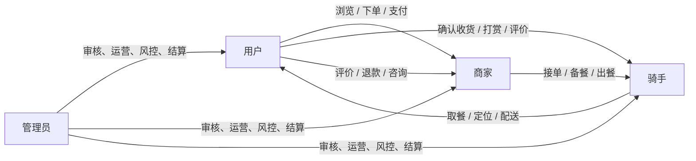

# CLAS 综合生活服务平台

> 面向校园与社区场景的多角色生活服务系统。项目以外卖为主线，覆盖用户消费、商家经营、骑手配送和平台运营，并扩展团购、到店预约、评价治理、公告通知等生活服务能力。

CLAS（Comprehensive Life Assistant System）不是单一的点餐页面，而是一个可以完整演示「下单—履约—结算—评价—运营」链路的全栈项目。前端提供四端工作台，后端以角色、状态机、审计记录和接口权限保证业务协作可追踪。

## 项目亮点

- 四角色协同：普通用户、商家、骑手和管理员使用同一账号体系，通过角色申请与切换进入各自工作台。
- 外卖履约闭环：支付、商家接单与出餐、骑手上线定位、任务调度、接单、取餐、配送、用户确认收货、评价和结算形成可追踪状态链路。
- 真实配送能力：附近任务按佣金、距离和智能路线排序；骑手支持多单配送、重新定位、配送时效、异常记录、收入流水、提现、小费和每日表现。
- 双向协作沟通：用户可联系商家和骑手；骑手可在配送期间联系用户、通过隐私号码拨号，并与订单所属商家双向聊天。
- 平台运营治理：管理员可审核商家/骑手申请、管理用户和订单、处理评价举报与申诉、审核提现，并查看统计仪表盘与运营数据。
- 安全与工程化：JWT + RBAC、BCrypt、Redis 验证码、幂等支付、内容审核、数据库迁移、H2 集成测试、GitHub Actions 构建测试与云端自动部署。

## 业务全景



### 外卖配送状态链路

```text
待支付 → 已支付 → 商家接单 → 备餐中 → 可配送
                                      ↓
骑手上线定位 → 接单 → 待取餐 → 配送中 → 已送达 → 用户确认 → 已完成
```

系统会记录订单及配送状态变更的时间线；骑手接单、取餐、送达等关键操作均由后端校验当前状态和订单归属。

## 功能模块

| 端 | 核心能力 |
| --- | --- |
| 用户端 | 手机号注册登录、地址管理、商家浏览与筛选、商品购物车、下单支付、订单追踪、联系商家/骑手、退款、收藏、团购、预约、公告、评价与举报 |
| 商家端 | 入驻申请与审核状态、营业开关、商品与分类、订单接单/出餐、联系用户/骑手、退款处理、团购券、预约、评价回复、经营分析与消息中心 |
| 骑手端 | 骑手申请与身份审核、开始/结束接单、浏览附近任务、佣金/距离/智能排序、接单、取餐、确认送达、实时定位、用户/商家沟通、隐私通话、收入、提现、评价与日绩效 |
| 管理端 | 数据仪表盘、用户/商家/骑手运营、订单全局查看、商家与骑手审核、角色申请、评价治理、申诉处理、公告管理、消息和统计导出 |

### 骑手配送模块

骑手模块是项目的重点履约能力，包含：

- 经管理员审核后获得 `RIDER` 身份；同一账号可保留 `USER`、`MERCHANT` 等多个已审批身份并切换。
- “上线”和“开始接单”分离：开始接单后才进入任务池；结束接单只停止接收新任务，手中订单仍须送完。
- 使用浏览器定位和高德 Web 服务能力计算附近可接任务，支持佣金、距离、智能路线三种排序。
- 每位骑手默认最多并行配送 3 单，管理员可调整上限；配送中订单按承诺送达时间排序，临近超时订单优先提示。
- 订单配送期间，骑手可联系用户、联系商家；用户可查看骑手位置与预计剩余时间。拨打用户时仅返回虚拟/脱敏号码，不暴露真实手机号。
- 用户可给骑手打赏并评价；平台按订单数、收入、评分、超时等指标生成骑手每日表现，支持收入结算与提现审核。

### 平台治理与内容安全

- 商家、骑手、角色申请和关键资料变更均支持审核、状态和审计记录。
- 评价支持图片、回复、点赞、举报、隐藏/删除申请、申诉与违规处罚等治理流程。
- 头像、昵称、评价和评论等内容提交前可通过本地敏感词与可选 DashScope 审核服务拦截。
- 公告支持发布、置顶、有效期和多端查看；通知中心支持业务消息跳转。

## 技术架构

| 层次 | 技术与职责 |
| --- | --- |
| 前端 | Vue 3、Vite、Vue Router、Pinia、Element Plus、Axios、ECharts；按角色路由守卫和工作台页面组织 |
| 后端 | Spring Boot 3.3、Spring Validation、MyBatis-Plus、Redis、JWT、BCrypt、Lombok |
| 数据 | MySQL 8，完整结构见 `database/schema.sql`；H2 测试库结构见 `backend/src/test/resources/schema-test.sql` |
| 工程 | Maven、npm、GitHub Actions、SSH 云端部署、数据库迁移脚本、后端集成测试 |

```text
浏览器（Vue 3）
    │ Axios + Bearer Token
    ▼
Spring Boot REST API
    ├── AuthInterceptor / @RequireRole / UserContext
    ├── Controller → Service → Mapper（MyBatis-Plus）
    ├── Redis：注册验证码等短期数据
    ├── MySQL：订单、角色、配送、结算、评价、审计等业务数据
    └── 可选能力：高德 Web 服务、DashScope 内容审核
```

## 项目结构

```text
.
├── backend/                         # Spring Boot 后端
│   ├── src/main/java/com/clas/
│   │   ├── config/                  # JWT、CORS、权限注解、请求上下文
│   │   ├── controller/              # 用户、订单、骑手、商家、管理端 REST API
│   │   ├── service/                 # 业务规则、状态机、调度、结算与审核
│   │   ├── entity/ mapper/ dto/     # 数据模型、持久层与接口对象
│   │   └── common/                  # 统一响应、异常与错误码
│   └── src/test/                    # H2 集成测试与测试数据库结构
├── frontend/                        # Vue 3 前端
│   ├── src/views/                   # 用户、商家、骑手、管理员页面
│   ├── src/components/              # 订单、聊天、商家工作台等复用组件
│   ├── src/api/                     # 按领域划分的 API 客户端
│   └── src/router/                  # 路由与角色访问控制
├── database/                        # MySQL 完整建库脚本与增量迁移
├── .github/workflows/deploy.yml     # 构建、测试、自动部署工作流
├── scripts/                         # 手动部署、数据初始化、烟雾测试辅助脚本
├── docs/                            # 项目文档
└── openspec/                        # 需求、设计与任务变更记录
```

## 架构演进设计

当前生产运行形态是单个 Spring Boot 后端；面向后续独立发布和扩缩容的微服务边界、服务接口清单及数据表唯一归属，见[微服务划分、接口与数据归属方案](docs/microservice-design.md)。该方案是演进设计，不代表当前已拆分为多个业务服务。

## 快速开始

### 1. 环境要求

| 工具 | 建议版本 |
| --- | --- |
| JDK | 17 |
| Maven | 3.9+ |
| Node.js | 22+ |
| MySQL | 8.0+ |
| Redis | 6+ |
| Docker Compose | v2+（容器化启动） |
| k3s | v1.30+（云端 Kubernetes 部署） |

### 2. 配置本地环境变量

后端的敏感配置由环境变量注入。PowerShell 示例：

```powershell
$env:MYSQL_PASSWORD = "你的 MySQL 密码"
$env:JWT_SECRET = "至少 32 字节的随机密钥"
$env:RIDER_IDENTITY_ENCRYPTION_KEY = "32 字节 AES 密钥"
$env:CORS_ALLOWED_ORIGINS = "http://localhost:5173,http://127.0.0.1:5173"
```

按需配置的可选能力：

```powershell
$env:AMAP_WEB_SERVICE_KEY = "高德 Web 服务 Key"
$env:DASHSCOPE_API_KEY = "DashScope API Key"
$env:FORBIDDEN_WORDS = "额外敏感词1,额外敏感词2"
```

也可创建仅保存在本机的 `backend/src/main/resources/application-local.yml` 覆盖配置；不要将密码、密钥、身份证明文或真实手机号提交到仓库。

登录页“获得权限”演示入口还需要在服务端启用 `CLAS_DEMO_ACCOUNTS_ENABLED=true`，并通过 `CLAS_DEMO_ACCESS_PASSWORD` 注入访问口令；两项均不得写入源码或提交到仓库。聊天 AI 审核的等待上限可用 `CHAT_MODERATION_TIMEOUT_MS` 配置，默认 3000 毫秒，超时后仅聊天会按本地词库结果降级。

### 3. 初始化数据库

首次开发或允许重建演示数据时，执行完整脚本：

```powershell
mysql --host=127.0.0.1 --port=3306 --user=root --password < database/schema.sql
```

已有历史数据库时，按文件名顺序执行 `database/migration-*.sql`，以保留原有数据并补齐表和字段。完整结构脚本会重建数据库；迁移前请先备份。

### 4. 启动后端

```powershell
Set-Location backend
mvn spring-boot:run
```

后端默认运行于 `http://127.0.0.1:8080`，健康检查为 `GET /api/health`。

### 5. 启动前端

另开一个终端：

```powershell
Set-Location frontend
npm install
npm run dev
```

前端默认地址为 `http://127.0.0.1:5173`。

### 6. 用 Docker Compose 在新机器启动

这是推荐的可复现启动方式。首先复制模板并填写随机密钥和数据库密码；`.env` 仅保存在本机，禁止提交。

```powershell
Copy-Item .env.example .env
# 编辑 .env，至少填写 MYSQL_PASSWORD、MYSQL_ROOT_PASSWORD、JWT_SECRET、RIDER_IDENTITY_ENCRYPTION_KEY
```

若本机访问 Docker Hub 出现 TLS 证书错误（`x509: certificate signed by unknown authority`），先通过镜像加速拉取并标记基础镜像：

```powershell
.\scripts\pull-base-images.ps1
docker compose --env-file .env build --pull=false
docker compose --env-file .env up -d
.\scripts\compose.ps1 smoke
```

否则可直接：

```powershell
.\scripts\compose.ps1 up
.\scripts\compose.ps1 smoke
```

Compose 会分别运行 `frontend`、`backend`、官方 MySQL 8.4 和 Redis 容器。首次空库启动会执行 `database/schema.sql` 并登记当前迁移基线；已有数据库不会执行完整建表脚本，而是执行未登记的 `migration-*.sql`。本地入口为 `http://127.0.0.1:8088/`。

常用操作：

```powershell
.\scripts\compose.ps1 logs
.\scripts\compose.ps1 down
```

演示数据不会自动导入。确认目标是演示库后，在具备 Bash 的环境中显式执行 `bash database/seed-demo.sh`。

## 演示账号与推荐演示流程

完整初始化脚本包含以下测试账号，密码均为 `Abc123!`，仅用于本地/演示数据库：

| 角色 | 手机号 | 账号名 |
| --- | --- | --- |
| 用户 | `13800000001` | `user` |
| 商家 | `13800000002` | `merchant` |
| 管理员 | `13800000003` | `admin` |
| 骑手一 | `13800000004` | `rider_one` |
| 骑手二 | `13800000005` | `rider_two` |

推荐答辩演示顺序：

1. 用户浏览商家、加入购物车、提交订单并模拟支付。
2. 商家进入工作台接单、备餐并标记可配送。
3. 骑手切换 `RIDER` 身份，开始接单、重新定位、按智能排序领取任务。
4. 骑手与商家确认出餐，取餐后用户在订单页查看骑手位置和预计到达时间。
5. 骑手通过订单沟通或隐私号码联系用户，确认送达；用户确认收货、打赏并评价。
6. 骑手查看收入、评价和日表现，申请提现；管理员在骑手运营页审核相关事项。

## 角色与权限模型

- 公开注册默认创建 `USER` 身份。
- 用户可提交商家或骑手申请；管理员审核通过后授予对应角色。
- 登录后系统读取账号已审批身份，用户可切换进入不同工作台。
- 后端通过 `Authorization: Bearer <token>`、`AuthInterceptor` 和 `@RequireRole` 校验；前端路由同样按角色限制访问。
- 所有金额以“分”为单位存储，展示层转换为“元”；支付接口支持 `Idempotency-Key`，避免重复扣款。

## 核心 API 导览

所有 `/api/**` 接口均使用统一响应结构，并回传/生成 `X-Request-Id` 方便联调与日志追踪。

```json
{
  "code": 200,
  "message": "success",
  "data": {},
  "timestamp": 1781179200000,
  "requestId": "trace-id",
  "errorCode": null
}
```

| 领域 | 示例接口 | 说明 |
| --- | --- | --- |
| 账户与身份 | `POST /api/user/login`、`POST /api/user/switch-role`、`POST /api/role-applications/rider` | 登录、角色切换、骑手申请 |
| 点餐与订单 | `GET /api/merchant/list`、`POST /api/order/create`、`POST /api/payment/mock` | 商家浏览、下单、模拟支付 |
| 商家履约 | `POST /api/order/accept/{id}`、`POST /api/order/ready-for-dispatch/{id}` | 接单、出餐并投放任务 |
| 骑手配送 | `GET /api/rider/tasks`、`POST /api/rider/tasks/{id}/claim`、`POST /api/rider/deliveries/{id}/pickup`、`POST /api/rider/deliveries/{id}/complete` | 任务池、接单、取餐、送达 |
| 配送沟通 | `GET/POST /api/rider/deliveries/{id}/messages`、`GET/POST /api/delivery/orders/{id}/merchant-messages` | 用户—骑手、骑手—商家订单内沟通 |
| 运营管理 | `GET /api/admin/dashboard`、`GET /api/admin/orders`、`GET /api/rider/admin/...` | 统计、订单运营、骑手审核与管理 |

接口以控制器和前端 `src/api/` 目录为准；生产环境请使用实际域名和 HTTPS。

## 测试与质量保障

```powershell
# 后端：使用 H2 内存数据库运行集成测试
mvn -f backend/pom.xml test

# 前端：生产构建检查
npm --prefix frontend run build

# 仅验证骑手配送及双向沟通链路
mvn -f backend/pom.xml -Dtest=RiderModuleIntegrationTest test
```

测试覆盖登录与权限隔离、订单取消、支付和评价、角色申请、骑手任务领取并发控制、配送生命周期、骑手资料审核、骑手—商家订单沟通等关键场景。

## CI/CD 与 k3s 部署

推送到 `main` 分支后，GitHub Actions 工作流 `.github/workflows/deploy.yml` 会执行严格门禁：

```text
push main
  → 后端 Maven 单元/集成测试
  → 前端 npm test + build
  → 构建并推送 GHCR SHA 镜像
  → k3s 数据库迁移 Job
  → Deployment rollout
  → http://8.141.112.182/api/health
```

任一测试失败时，镜像构建、GHCR 推送和 k3s 部署均不会执行。前端和后端镜像分别为 `ghcr.io/amyjinru/clas-frontend:<git-sha>` 与 `ghcr.io/amyjinru/clas-backend:<git-sha>`；部署禁止使用 `latest`。工作流无论成功或失败都会上传测试报告、镜像摘要和 k3s 诊断日志。

首次云端准备使用 root 用户执行：

```bash
bash scripts/k8s/install-k3s.sh
```

在 GitHub Actions Secrets 中配置以下值：`SSH_PASSWORD`（云服务器部署账户密码）、`GHCR_USERNAME`、`GHCR_PULL_TOKEN`、`MYSQL_PASSWORD`、`JWT_SECRET`、`RIDER_IDENTITY_ENCRYPTION_KEY`，以及按需配置的 `AMAP_WEB_SERVICE_KEY`、`DASHSCOPE_API_KEY`、`FORBIDDEN_WORDS`、`CLAS_DEMO_ACCESS_PASSWORD`。部署 Job 经 SSH 调用服务器本机 k3s，不再使用 kubeconfig Secret；镜像仍发布至 GHCR，并以 Git SHA 版本归档导入服务器。Secret 不得写入仓库或工作流日志。

手动部署已发布镜像时，配置同名环境变量后执行：

```bash
CLAS_IMAGE_TAG=<git-sha> bash scripts/k8s/deploy.sh
```

首次从现网 MySQL 切换时，必须先完成 `mysqldump` 备份；仅在确认导入目标为空 PVC 后，显式指定备份文件恢复，避免误覆盖已有 k3s 数据库：

```bash
CLAS_IMAGE_TAG=<git-sha> CLAS_DATABASE_RESTORE_FILE=/opt/clas-backups/<时间戳>/clas.sql.gz bash scripts/k8s/deploy.sh
```

未设置 `CLAS_DATABASE_RESTORE_FILE` 时，部署脚本绝不会导入或覆盖数据库。

首次从旧 Nginx/systemd 服务切换到 k3s 时，可额外设置 `CLAS_STOP_LEGACY_NGINX=true`。脚本会等待新前后端 Pod 就绪后，才停用旧 Nginx 并启用 Ingress，避免旧服务掩盖健康检查结果。

部署清单位于 `k8s/`：MySQL 使用官方镜像和 PVC，后端使用 `/api/health` 作为 readiness/liveness probe，Ingress 在当前公网 IP `http://8.141.112.182/` 暴露前端。当前入口没有 DNS 域名，故仅提供 HTTP；获得域名后可在 `k8s/ingress.yaml` 增加 Host 与 TLS 配置。

## 文档与协作

- `看板.md`：团队任务看板的可读摘要。
- `docs/`：项目过程文档与交付材料。
- `openspec/changes/add-rider-delivery-system/`：骑手配送功能的需求、设计与任务记录。
- `database/schema.sql` 与 `database/migration-*.sql`：完整数据库结构和增量演进脚本。
- `.github/workflows/deploy.yml`：持续集成与自动部署的可审查流水线。

## 安全提示

- 不要提交真实数据库密码、JWT 密钥、高德/DashScope 密钥、身份证原文或真实用户联系方式。
- 生产环境必须设置强随机 `JWT_SECRET`、`RIDER_IDENTITY_ENCRYPTION_KEY` 和数据库密码，并限制 `CORS_ALLOWED_ORIGINS`。
- 骑手联系用户使用订单归属校验和虚拟/脱敏号码机制；商家与骑手沟通仅在订单配送期间开放写入。

---

如需继续迭代，请从 `dev` 分支开始开发，保持数据库迁移、接口实现、前端页面和自动化测试同步更新。
