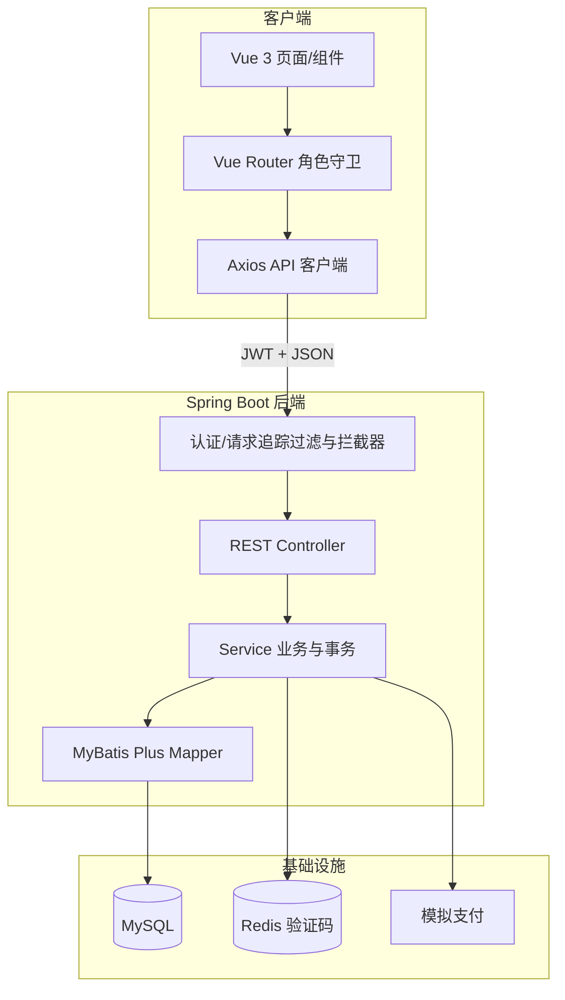
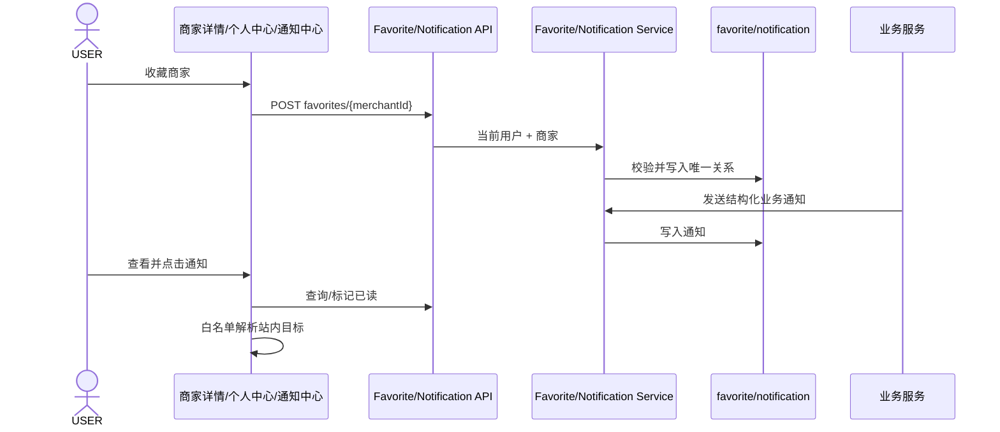
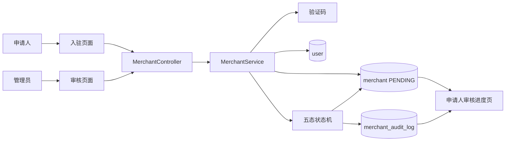
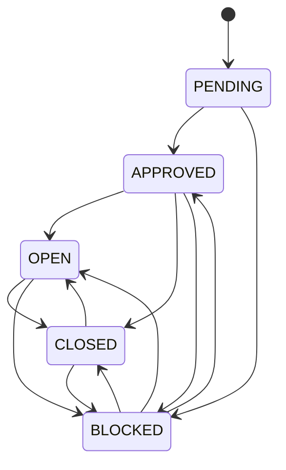
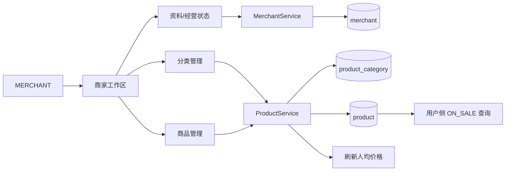
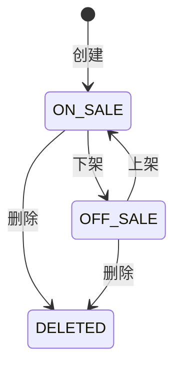
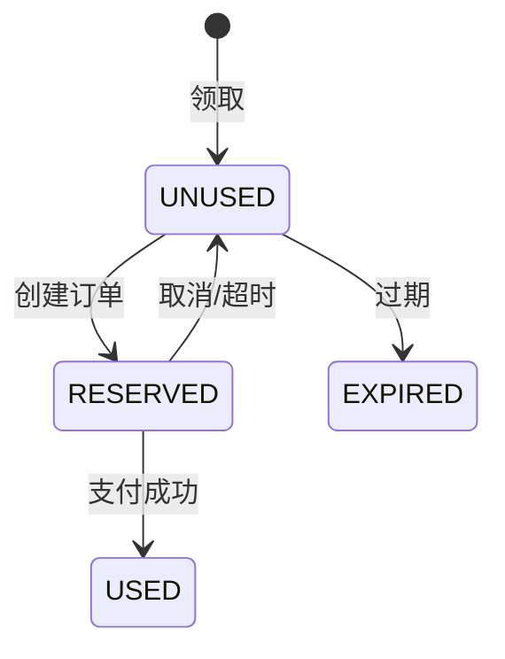
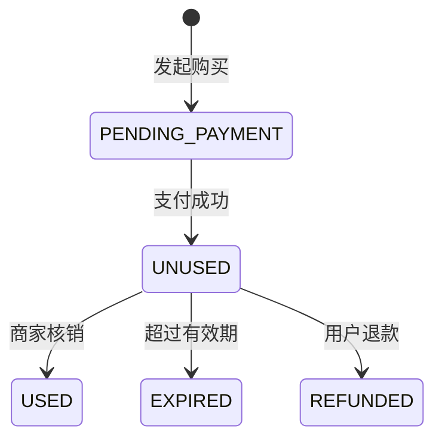
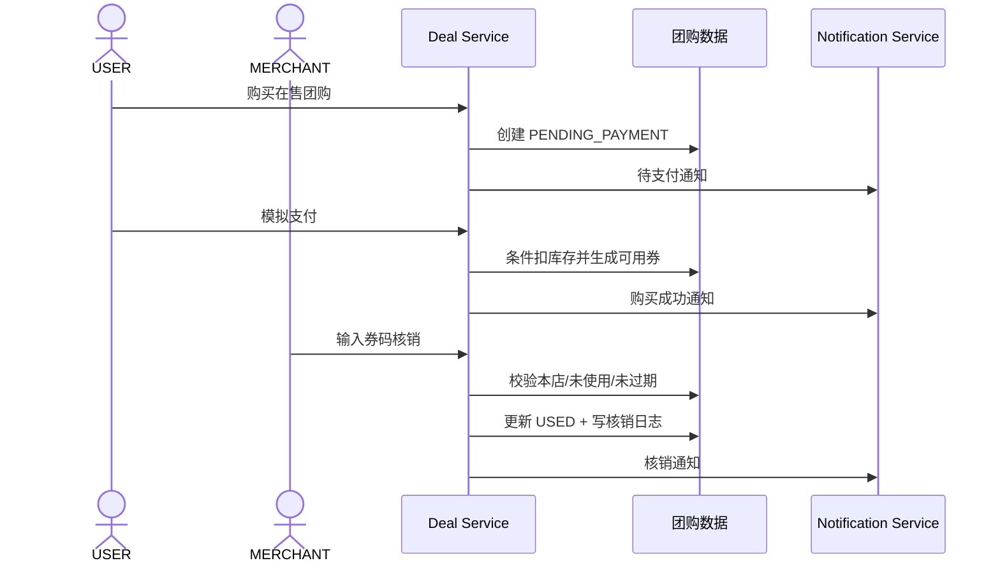
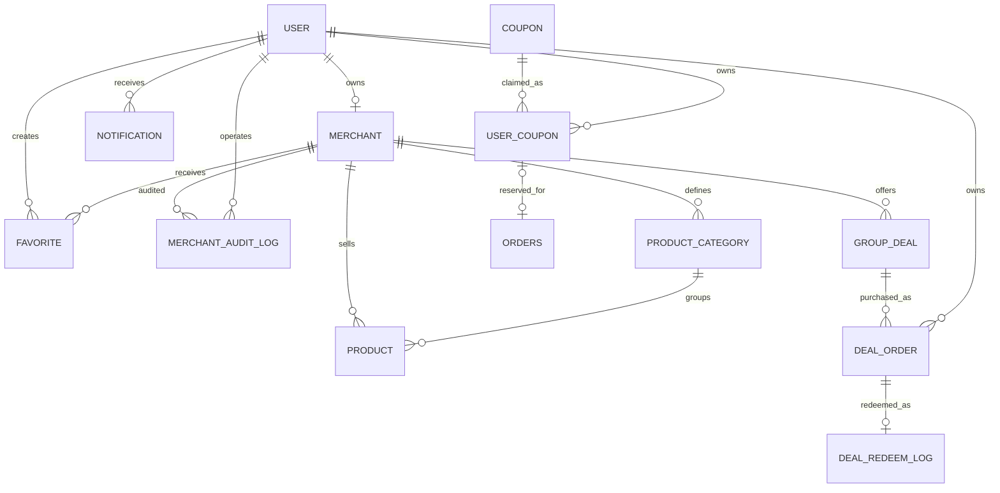

# CLAS UC05–UC08 概要设计说明书

| 项目 | 内容 |
| --- | --- |
| 文档版本 | V1.0 |
| 编制日期 | 2026-08-25 |
| 设计范围 | UC05–UC08 |
| 对应需求 | [02-需求说明书.md](02-需求说明书.md) |
| 文档状态 | 基于当前实现整理 |

## 1. 设计目标

本文档从系统级说明 UC05–UC08 的架构分层、模块职责、数据流、状态机、接口边界、安全策略和部署依赖。类、方法、字段及测试映射见 [04-详细设计说明书.md](04-详细设计说明书.md)。

设计目标：

1. 用户、商家和管理员权限清晰隔离。
2. 收藏、通知、审核、商品及券状态可持久化和追溯。
3. 交易状态变化保持一致，失败时不留下部分成功数据。
4. 当前实现可以由前端页面、REST API 和自动化测试分层验证。

## 2. 总体架构

### 2.1 技术架构



### 2.2 分层职责

| 层次 | 职责 |
| --- | --- |
| 页面/组件层 | 展示状态、采集输入、触发操作、提示结果 |
| 路由与 API 客户端层 | 角色入口控制、JWT 请求、统一响应解包 |
| Controller 层 | REST 映射、请求校验、角色注解、当前身份传递 |
| Service 层 | 业务规则、所有权、状态机、事务和通知联动 |
| Mapper/数据库层 | 查询、持久化、唯一约束、条件更新和审计数据 |

### 2.3 身份和权限

```mermaid
flowchart LR
    T[Authorization: Bearer JWT] --> I[AuthInterceptor]
    I --> U[UserContext]
    U --> RR[@RequireRole]
    RR --> USER[USER 接口]
    RR --> MERCHANT[MERCHANT 接口]
    RR --> ADMIN[ADMIN 接口]
    U --> OWN[Service 所有权校验]
```

路由守卫改善前端体验，后端 `@RequireRole` 和服务层归属判断构成最终安全边界。

## 3. 模块划分

| 模块编号 | 模块 | 主要职责 | 对应用例 |
| --- | --- | --- | --- |
| `MOD-AUTH` | 认证与授权 | JWT 解析、UserContext、角色校验 | 全部 |
| `MOD-FAV` | 收藏 | 收藏、取消、本人列表、唯一性 | UC05 |
| `MOD-NOTIFY` | 通知 | 通知写入、排序、已读、删除、跳转目标 | UC05、UC08 |
| `MOD-MERCHANT` | 商家 | 入驻、资料、审核状态、经营开关 | UC06、UC07 |
| `MOD-AUDIT` | 审核 | 状态机、管理员备注、审核日志 | UC06 |
| `MOD-PRODUCT` | 商品与分类 | 分类和商品 CRUD、上下架、软删除 | UC07 |
| `MOD-COUPON` | 普通优惠券 | 领取、可用性、预占、释放、核销 | UC08 |
| `MOD-ORDER` | 普通订单/支付 | 订单创建、取消、超时、模拟支付 | UC08 |
| `MOD-DEAL` | 团购券 | 团购购买、支付、券码、核销、退款 | UC08 |

## 4. 用例概要设计

### 4.1 ARC-05 收藏与通知架构



关键决策：

- 收藏以数据库唯一约束和服务层重复查询共同保证幂等。
- 通知读取和变更均按当前用户限定。
- 业务目标使用结构化字段；旧数据仅安全回填。
- 客户端通知跳转采用白名单而非直接信任数据库路径。

### 4.2 ARC-06 入驻审核架构



审核状态机：



关键决策：

- 入驻统一落到商家服务，兼容游客建号和登录用户申请。
- 商家初始状态固定为 PENDING，审核和开店分步完成。
- 状态变更与审计日志在同一事务中完成。
- 管理端通过 RBAC 保护，申请人只能查看本人审核进度。

### 4.3 ARC-07 店铺与商品管理架构



商品状态机：



关键决策：

- 当前商家 ID 由服务端账号绑定关系解析。
- 店铺敏感资料变更采用按字段验证码。
- 平台审核状态和商家临时打烊标志分离。
- 商品采用软删除，保留订单历史引用。
- 分类删除先解除商品分类关系，避免误删商品。

### 4.4 ARC-08 优惠券与团购券架构

普通优惠券：



团购订单/券：





关键决策：

- 普通券通过 `RESERVED` 中间态关联订单，避免同券多单使用。
- 限量领取、券预占、券使用和团购扣库存采用条件更新。
- 团购在发起购买时不扣库存，支付成功时才扣库存并生成正式券码。
- 核销以券码查询，但必须验证当前商家归属。
- 普通优惠券和购买型团购券使用独立数据模型和状态机。

## 5. 数据架构



关键完整性约束：

- `favorite(user_id, merchant_id)` 唯一。
- `user_coupon(user_id, coupon_id)` 唯一。
- 商家、商品、分类、团购订单通过归属字段进行权限判断。
- 审核日志和核销日志不承担当前状态，而是作为审计历史保存。

## 6. 接口架构

| 接口域 | 访问角色 | 主要职责 |
| --- | --- | --- |
| `/api/favorites` | USER | 收藏关系管理 |
| `/api/notifications` | USER/MERCHANT/ADMIN | 本人通知生命周期 |
| `/api/merchant/register` | 游客或已登录用户 | 商家入驻 |
| `/api/merchant/my/**` | MERCHANT | 本人商家资料、审核进度、经营状态 |
| `/api/merchant/admin/**` | ADMIN | 商家列表、审核、日志 |
| `/api/merchant/me/products` | MERCHANT | 当前商家商品管理 |
| `/api/product/**` | 公共查询或 MERCHANT 管理 | 商品展示与分类管理 |
| `/api/coupon/**` | USER | 普通券领取和查询 |
| `/api/order/**`、`/api/payment/**` | USER/MERCHANT | 普通订单与支付 |
| `/api/deals/**` | 公共查询、USER 购买、MERCHANT 管理/核销 | 团购全生命周期 |

## 7. 安全与一致性设计

### 7.1 安全控制

- 请求拦截器解析 JWT 并写入 `UserContext`。
- Controller 使用 `@RequireRole` 限定角色。
- Service 校验资源所有权，防止水平越权。
- 密码使用 BCrypt；验证码存储在 Redis。
- 通知路径只能由安全解析逻辑生成或回填。

### 7.2 事务边界

| 操作 | 一致性范围 |
| --- | --- |
| 商家入驻 | 账号角色与商家创建 |
| 管理员审核 | 商家状态/备注与审核日志 |
| 普通券领取 | 券领取数与用户券 |
| 普通订单创建 | 订单与用户券预占 |
| 普通订单取消/超时 | 订单状态与券释放 |
| 普通订单支付 | 库存、支付、订单状态、券使用 |
| 团购支付 | 库存与团购订单可用状态 |
| 团购核销 | 团购订单状态与核销日志 |
| 团购退款 | 团购订单状态与库存恢复 |

## 8. 运行与部署概要

运行依赖：JDK/Maven、Node.js/npm、MySQL、Redis。默认后端端口为 8080，前端开发端口为 5173。数据库使用 `database/schema.sql` 初始化，旧库按顺序执行 `database/migration-*.sql`。

启动顺序：MySQL → Redis → Spring Boot 后端 → Vue/Vite 前端。

演示账号和环境变量要求以仓库 `README.md` 为准。

## 9. 设计限制与风险

| 风险/限制 | 处理方式 |
| --- | --- |
| 当前为模拟支付 | 仅用于业务状态验证，不代表真实支付安全性 |
| 通知不是实时推送 | 用户进入页面后拉取；后续可扩展 SSE/WebSocket |
| 历史通知字段不完整 | 安全解析并验证归属后回填 |
| 文档基于当前实现 | 行为变更时必须同步更新需求、设计和追溯矩阵 |
| 测试尚未执行 | 不在本文档中声明通过，结果留待测试阶段记录 |

## 10. 概要设计追溯

| 概要设计 | 覆盖需求 |
| --- | --- |
| `ARC-05` | REQ-UC05-01～05 |
| `ARC-06` | REQ-UC06-01～04 |
| `ARC-07` | REQ-UC07-01～05 |
| `ARC-08` | REQ-UC08-01～06 |
| 认证与权限架构 | 全部需求的身份/所有权约束 |
| 数据与事务架构 | REQ-UC05-01/04、REQ-UC06-02～04、REQ-UC07-04～05、REQ-UC08-01～05 |
