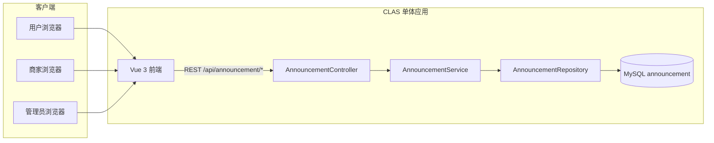
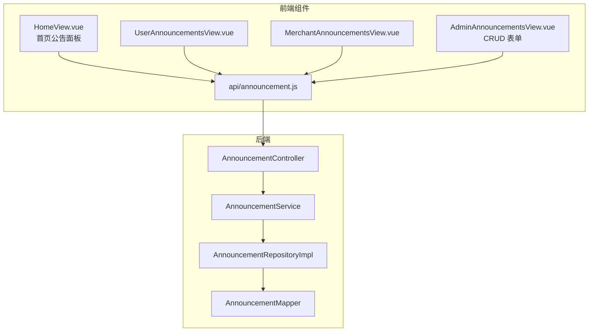
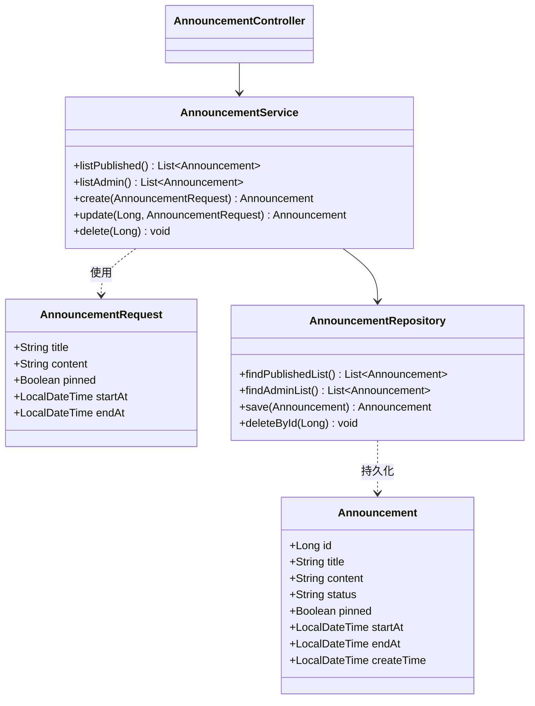
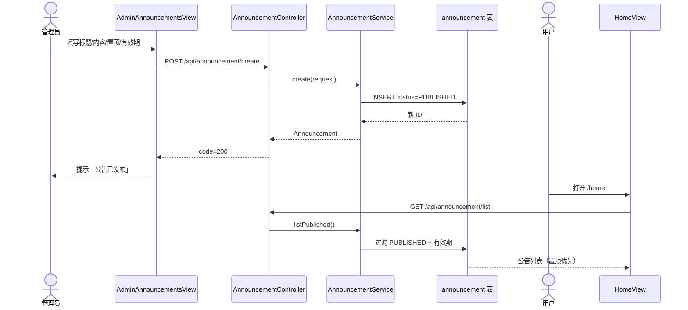

# UC13 平台公告管理

| 属性 | 内容 |
| --- | --- |
| **用例编号** | UC13 |
| **用例名称** | 平台公告管理 |
| **负责人** | 成员 E（测试质量 / 用例文档） |
| **关联需求** | REQ-PLT-01 平台公告发布与展示 |
| **文档版本** | V1.1 |
| **编写日期** | 2026-08-25 |
| **机测日期** | 2026-08-28 |

---

## 1. 需求说明

平台管理员需要向全体用户和商家发布运营公告（活动通知、维护说明、规则变更等）。公告支持**置顶**与**有效期窗口**（`startAt` / `endAt`），用户端、商家端和管理端均可查看当前有效公告；仅管理员可创建、编辑、删除。

**业务价值**：统一信息触达，减少客服重复答疑；有效期与置顶保证重要信息优先展示且过期自动隐藏。

---

## 2. 用例说明

### 2.1 参与者

| 参与者 | 说明 |
| --- | --- |
| **管理员（ADMIN）** | 创建、编辑、删除公告；查看全部公告（含未在有效期内展示的） |
| **用户（USER）** | 浏览当前有效公告 |
| **商家（MERCHANT）** | 浏览当前有效公告 |
| **系统** | 按状态、有效期、置顶规则过滤并排序公告列表 |

### 2.2 触发条件

- **UC13-A 发布公告**：管理员在「公告管理」页填写标题、内容并提交。
- **UC13-B 浏览公告**：用户/商家进入首页、公告专页，或管理员进入公告管理页。
- **UC13-C 维护公告**：管理员编辑或删除已有公告。

### 2.3 前置条件

| 场景 | 前置条件 |
| --- | --- |
| 管理端写操作 | 管理员已登录，JWT 有效，角色为 `ADMIN` |
| 公共列表 | 无登录要求（`GET /api/announcement/list`） |
| 用户/商家专页 | 已登录且角色为 `USER` 或 `MERCHANT` |

### 2.4 主成功流程

**UC13-A 管理员发布并展示公告**

1. 管理员访问 `/admin/announcements`，系统加载全部公告列表（`GET /api/announcement/admin/list`）。
2. 管理员填写标题、内容，可选设置置顶、开始时间、结束时间，点击发布。
3. 系统校验请求体（`@Valid AnnouncementRequest`），创建记录：`status=PUBLISHED`，写入 `announcement` 表。
4. 系统返回 HTTP 200，`code=200`，`data` 含新公告 ID。
5. 用户访问 `/home` 或 `/user/announcements`，系统调用 `GET /api/announcement/list`。
6. 系统过滤：`status=PUBLISHED` 且当前时间在 `[startAt, endAt]` 窗口内（空值表示不限制），按 **置顶降序 → 创建时间降序** 返回。
7. 前端展示公告标题与摘要；用户可展开查看详情。

**UC13-B 用户浏览首页公告面板**

1. 用户登录后进入 `/home`。
2. `HomeView` 调用 `listAnnouncements()`，侧边栏「平台公告」面板渲染列表。
3. 若无有效公告，面板不显示。

### 2.5 备选流程与异常流程

| 编号 | 条件 | 系统行为 | 可验证结果 |
| --- | --- | --- | --- |
| UC13-E1 | 非管理员调用创建/更新/删除 | `AuthInterceptor` + `@RequireRole("ADMIN")` 拦截 | HTTP **403**；无数据变更（机测 UC13-API-02 已验证） |
| UC13-E2 | 未登录调用管理端列表 | 同上 | HTTP **401** 或 **403** |
| UC13-E3 | 更新/删除不存在的公告 ID | `AnnouncementService.requireAnnouncement` 抛业务异常 | HTTP 400，`message=公告不存在` |
| UC13-E4 | 标题或内容为空（前端） | 前端校验拦截 | 提示「请填写公告标题和内容」，不发起请求 |
| UC13-E5 | 公告 `endAt` 已过期 | 公共列表查询条件排除 | `GET /list` 不包含该条；管理端 `/admin/list` 仍可见 |
| UC13-E6 | 公告 `startAt` 在未来 | 公共列表暂不可见 | 到达 `startAt` 后自动出现在公共列表 |
| UC13-A1 | 管理员编辑已有公告 | `PUT /api/announcement/{id}` | 字段更新；公共列表反映新内容 |
| UC13-A2 | 管理员删除公告 | `DELETE /api/announcement/{id}` | 记录删除；公共列表不再包含 |

### 2.6 可验证结果（验收标准）

- [x] 管理员可成功创建公告，数据库 `announcement` 表新增一行。（UC13-INT-02 / UC13-API-03）
- [x] 公共接口返回已发布公告列表，生产环境 2026-08-28 实测 **7 条**。（UC13-API-01）
- [ ] 置顶与有效期窗口过滤需手工或补专用 INT 用例验证。（UC13-MAN-01）
- [x] 非管理员无法创建公告，USER 调用返回 **403**。（UC13-API-02）
- [ ] 删除不存在公告的 400 响应待补 INT 用例。

---

## 3. 设计图

### 3.1 系统级图（UC13 在 CLAS 中的位置）



### 3.2 组件级图



### 3.3 对象级图（核心领域对象）



### 3.4 活动图（发布公告主流程）



---

## 4. 代码映射

| 层次 | 路径 | 职责 |
| --- | --- | --- |
| 控制器 | `backend/.../controller/AnnouncementController.java` | REST 入口；管理端 `@RequireRole("ADMIN")` |
| 服务 | `backend/.../service/AnnouncementService.java` | 创建/更新/删除；默认 `PUBLISHED` |
| 仓储 | `backend/.../repository/AnnouncementRepository.java` | 仓储接口 |
| 仓储实现 | `backend/.../repository/impl/AnnouncementRepositoryImpl.java` | 有效期过滤、置顶排序 |
| 实体 | `backend/.../entity/Announcement.java` | 表 `announcement` 映射 |
| DTO | `backend/.../dto/AnnouncementRequest.java` | 创建/更新请求体 |
| 数据库 | `database/schema.sql` → 表 `announcement` | 持久化 |
| 前端 API | `frontend/src/api/announcement.js` | 封装 5 个公告接口 |
| 管理页 | `frontend/src/views/admin/AdminAnnouncementsView.vue` | CRUD UI |
| 用户首页 | `frontend/src/views/HomeView.vue` | 侧边栏公告预览 |
| 用户专页 | `frontend/src/views/user/UserAnnouncementsView.vue` | 公告列表页 |
| 商家专页 | `frontend/src/views/merchant/MerchantAnnouncementsView.vue` | 公告列表页 |
| 路由 | `frontend/src/router/index.js` | `/admin/announcements`、`/user/announcements` 等 |

---

## 5. 测试映射与结果

> **机测环境**：生产 `http://8.141.112.182` + 本地 H2 集成测试（`mvn test`）  
> **机测时间**：2026-08-28  
> **结果归档**：[`uc13-15-api-results.json`](./uc13-15-api-results.json)

| 测试编号 | 类型 | 对应用例步骤 | 测试位置 | 状态 | 机测证据 |
| --- | --- | --- | --- | --- | --- |
| UC13-INT-01 | INT | 公共列表返回 ≥1 条公告 | `ModuleIntegrationTest.announcementListWorks` | ✅ PASS | `mvn test` 2026-08-28 |
| UC13-INT-02 | INT | 管理员创建公告 | `ModuleIntegrationTest.createAnnouncementWorks` | ✅ PASS | `mvn test` 2026-08-28 |
| UC13-API-01 | API | `GET /api/announcement/list` | `run_uc13_15_api_test.py` | ✅ PASS | status=200，count=7 |
| UC13-API-02 | API | USER 创建公告 → 403 | 同上 | ✅ PASS | 覆盖原 UC13-INT-03 |
| UC13-API-03 | API | ADMIN 创建「机测公告」 | 同上 | ✅ PASS | title=机测公告 |
| UC13-API-04 | API | ADMIN `/admin/list` | 同上 | ✅ PASS | status=200 |
| UC13-MAN-01 | 手工 | 置顶 + 有效期展示 | TC-F-031 | 📋 待执行 | — |
| UC13-E2E-01 | E2E | 首页公告 DOM | `clas-order-flow.spec.js` | ⚠️ 弱断言 | 仅 count≥0 |

**执行命令**

```bash
# 后端集成（H2）
cd backend && mvn test "-Dtest=ModuleIntegrationTest#announcementListWorks+createAnnouncementWorks"

# 生产 API 冒烟（需网络；重复运行可能触发单设备登录 409，间隔执行或换验证码登录）
python docs/use-cases/run_uc13_15_api_test.py
```

---

## 6. 追溯矩阵（需求 → 设计 → 代码 → 测试）

| 需求项 | 设计要素 | 代码 | 测试 |
| --- | --- | --- | --- |
| 发布公告 | 活动图 3.4；对象 AnnouncementRequest | `AnnouncementController.create` | UC13-INT-02 |
| 有效期过滤 | 对象级 Repository 查询条件 | `AnnouncementRepositoryImpl.findPublishedList` | UC13-MAN-01 |
| 置顶排序 | 同上 `orderByDesc(pinned)` | 同上 | UC13-MAN-01 |
| 公共浏览 | 组件级 HomeView | `HomeView.vue` + `listAnnouncements` | UC13-API-01, UC13-E2E-01 |
| 权限控制 | 系统级 ADMIN 角色 | `@RequireRole("ADMIN")` | UC13-API-02 ✅ |

---

## 7. 演示步骤（中期检查）

1. 使用管理员账号 `13800000003 / Abc123!` 登录，进入 **公告管理**（`/admin/announcements`）。
2. 新建公告「暑期配送说明」，勾选置顶，设置结束时间为 7 天后，发布。
3. 退出，用用户 `13800000001` 登录 `/home`，确认侧边栏可见该公告且置顶展示。
4. Postman 调用 `GET http://8.141.112.182/api/announcement/list`，确认 JSON 含该标题。
