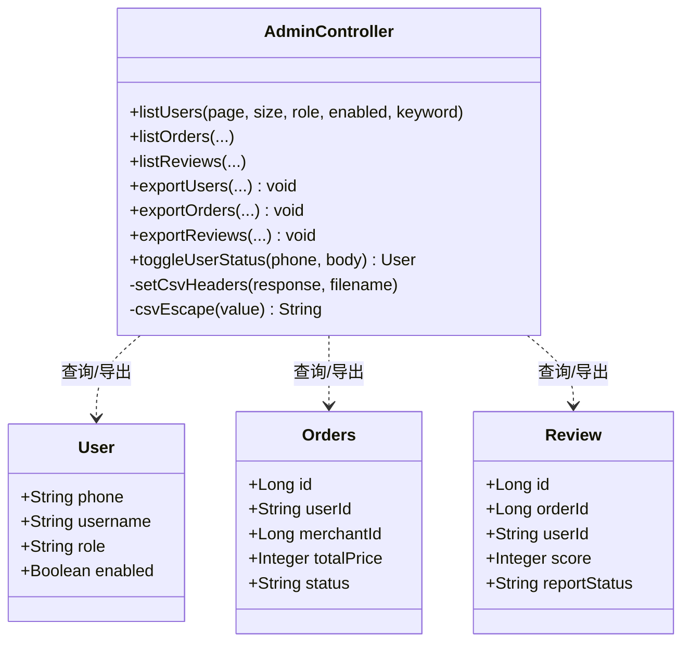
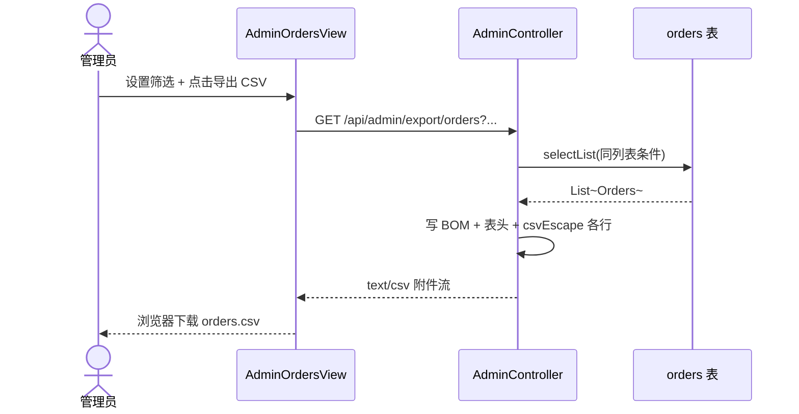

# UC14 管理监管与数据导出

| 属性 | 内容 |
| --- | --- |
| **用例编号** | UC14 |
| **用例名称** | 管理监管与数据导出 |
| **负责人** | 成员 E（测试质量 / 用例文档） |
| **关联需求** | REQ-ADM-02 管理员数据监管；REQ-ADM-03 CSV 导出 |
| **文档版本** | V1.1 |
| **编写日期** | 2026-08-25 |
| **机测日期** | 2026-08-28 |

---

## 1. 需求说明

平台管理员需要对用户、订单、评价等核心数据进行**分页查询、条件筛选与监管操作**（如禁用用户、处理评价举报），并支持将筛选结果**导出为 UTF-8 CSV 文件**，供离线审计、归档或向教师提交实验材料。

**业务价值**：满足课程「管理监管」验收点；导出功能支撑数据合规检查与实验报告附件。

---

## 2. 用例说明

### 2.1 参与者

| 参与者 | 说明 |
| --- | --- |
| **管理员（ADMIN）** | 查询/监管/导出；类级别 `@RequireRole("ADMIN")` |
| **普通用户 / 商家** | 不得访问 `/api/admin/**` 导出与管理接口 |
| **系统** | 按筛选条件查询数据库，生成 CSV 流式响应 |

### 2.2 触发条件

- **UC14-A 分页监管查询**：管理员进入用户/订单/评价管理页并加载列表。
- **UC14-B CSV 导出**：管理员在列表页设置筛选条件后点击「导出 CSV」。
- **UC14-C 用户监管**：管理员禁用/启用用户账号。

### 2.3 前置条件

| 场景 | 前置条件 |
| --- | --- |
| 全部管理操作 | 管理员已登录，JWT 有效 |
| 导出 | 浏览器允许下载；前端通过 `window.open` 携带当前筛选 query |
| 数据存在 | `user` / `orders` / `review` 表中有种子或业务数据 |

### 2.4 主成功流程

**UC14-B 按条件导出订单 CSV（典型）**

1. 管理员登录，进入 `/admin/orders`（`AdminOrdersView.vue`）。
2. 管理员可选填：订单状态、日期区间、关键词（用户手机/地址/订单 ID）。
3. 管理员点击「导出 CSV」。
4. 前端调用 `exportAdminOrders(params)`（`api/admin.js`），通过 **axios blob 下载**（非 `window.open`），文件名 `orders.csv`。
5. 后端 `AdminController.exportOrders` 使用与列表相同的 `LambdaQueryWrapper` 条件查询 `orders` 表。
6. 后端设置响应头：`Content-Type: text/csv; charset=UTF-8`，`Content-Disposition: attachment; filename="orders.csv"`。
7. 写入 UTF-8 BOM 表头及数据行（订单 ID、用户手机、商家 ID、金额、状态等）。
8. 浏览器下载 `orders.csv`；管理员可用 Excel 打开验证行数与筛选一致。

**UC14-A 用户列表监管查询**

1. 管理员进入 `/admin/users`。
2. 前端调用 `GET /api/admin/users?page=1&size=10&role=&enabled=&keyword=`。
3. 后端分页查询，**屏蔽 password 字段**，返回 `records/total/page/size`。
4. 页面展示用户列表，支持按角色、启用状态、关键词筛选。

**UC14-C 禁用用户**

1. 管理员在用户列表对某用户点击禁用。
2. 前端调用 `PUT /api/admin/users/{phone}/status`，body `{ "enabled": false }`。
3. 后端更新 `user.enabled=0`；该用户下次登录被拒绝（`UserService.login` 校验）。

### 2.5 备选流程与异常流程

| 编号 | 条件 | 系统行为 | 可验证结果 |
| --- | --- | --- | --- |
| UC14-E1 | 普通用户访问 `/api/admin/export/users` | RBAC 拦截 | HTTP **403**（机测 UC14-API-03） |
| UC14-E2 | 未携带 Token | 鉴权失败 | HTTP 401 |
| UC14-E3 | 禁用不存在用户 | `BusinessException` | HTTP 400，`用户不存在` |
| UC14-E4 | 导出结果为空 | 仍返回 CSV，仅含表头 | 文件可打开，无数据行 |
| UC14-E5 | 字段含逗号/换行 | `csvEscape` 加引号转义 | CSV 格式正确，Excel 不乱列 |
| UC14-A1 | 导出评价（含举报状态筛选） | `GET /api/admin/export/reviews` | 同 UC14-B 流程 |
| UC14-A2 | 导出用户（含角色筛选） | `GET /api/admin/export/users` | 同 UC14-B 流程 |

### 2.6 可验证结果（验收标准）

- [x] 导出接口仅 ADMIN 可访问，USER 导出 users 返回 **403**。（UC14-API-03）
- [x] 订单 CSV 含 UTF-8 BOM 与表头「订单ID,用户手机,...」。（UC14-API-02）
- [x] 评价 CSV 可正常下载。（UC14-API-04）
- [x] 用户列表**无明文 password**；JSON 中 `password` 可能为 `null`（未查询该列），机测无哈希/明文泄露。（UC14-API-01）
- [ ] 禁用用户后登录失败待手工验证。（UC14-MAN-02）

---

## 3. 设计图

### 3.1 系统级图

```mermaid
flowchart LR
  subgraph AdminClient["管理端"]
    AD[AdminLayout + 各管理 View]
  end

  subgraph CLAS["CLAS 后端"]
    AC[AdminController<br/>@RequireRole ADMIN]
    UM[UserMapper]
    OM[OrdersMapper]
    RM[ReviewMapper]
    DB[(MySQL)]
  end

  AD -->|/api/admin/*| AC
  AC --> UM & OM & RM --> DB
  AC -->|export/*| CSV[CSV HttpServletResponse 流]
  CSV --> AD
```

### 3.2 组件级图

```mermaid
flowchart TB
  subgraph Pages["管理端页面"]
    AU[AdminUsersView.vue<br/>导出 users]
    AO[AdminOrdersView.vue<br/>导出 orders]
    AR[AdminReviewsView.vue<br/>导出 reviews]
  end

  subgraph API["前端"]
    ADM[api/admin.js<br/>列表接口]
    EXP[exportAdmin*<br/>axios blob 下载]
  end

  subgraph Backend["AdminController 分区"]
    LIST[GET /users /orders /reviews]
    EXPORT[GET /export/users|orders|reviews]
    TOGGLE[PUT /users/{phone}/status]
  end

  AU --> ADM & EXP
  AO --> ADM & EXP
  AR --> ADM & EXP
  ADM --> LIST
  EXP --> EXPORT
  AU --> TOGGLE
```

### 3.3 对象级图（导出相关）



### 3.4 活动图（CSV 导出）



---

## 4. 代码映射

| 层次 | 路径 | 职责 |
| --- | --- | --- |
| 控制器 | `backend/.../controller/AdminController.java` | 类级 `@RequireRole("ADMIN")`；列表 + 导出 + 用户状态 |
| 用户列表 | 同上 `listUsers` / `exportUsers` | 分页；导出 CSV |
| 订单列表 | 同上 `listOrders` / `exportOrders` | 状态/日期/关键词 |
| 评价列表 | 同上 `listReviews` / `exportReviews` | 举报状态/关键词 |
| 用户禁用 | 同上 `toggleUserStatus` | 更新 `enabled` |
| 登录校验 | `backend/.../service/UserService.java` | `enabled` 校验 |
| 前端-用户 | `frontend/src/views/admin/AdminUsersView.vue` | 列表 + `exportAdminUsers()` |
| 前端-订单 | `frontend/src/views/admin/AdminOrdersView.vue` | 列表 + `exportAdminOrders()` |
| 前端-评价 | `frontend/src/views/admin/AdminReviewsView.vue` | 列表 + `exportAdminReviews()` |
| 前端 API | `frontend/src/api/admin.js` | `downloadCsv()` blob 下载 |
| 路由 | `frontend/src/router/index.js` | `/admin/users`、`/admin/orders`、`/admin/reviews` |

**导出 API 清单**

| 接口 | 说明 |
| --- | --- |
| `GET /api/admin/export/users` | 参数：`role`, `enabled`, `keyword` |
| `GET /api/admin/export/orders` | 参数：`status`, `startDate`, `endDate`, `keyword` |
| `GET /api/admin/export/reviews` | 参数：`reportStatus`, `keyword` |

---

## 5. 测试映射与结果

> **机测环境**：生产 `http://8.141.112.182` + 本地 H2（`adminMerchantListRequiresAdminRole`）  
> **机测时间**：2026-08-28  
> **结果归档**：[`uc13-15-api-results.json`](./uc13-15-api-results.json)

| 测试编号 | 类型 | 对应用例步骤 | 测试位置 | 状态 | 机测证据 |
| --- | --- | --- | --- | --- | --- |
| UC14-INT-01 | INT | 未登录/USER/ADMIN 分层鉴权 | `ModuleIntegrationTest.adminMerchantListRequiresAdminRole` | ✅ PASS | 401/403/200 |
| UC14-API-01 | API | 用户列表无明文 password | `run_uc13_15_api_test.py` | ✅ PASS | plaintext=false |
| UC14-API-02 | API | ADMIN 导出 orders CSV | 同上 | ✅ PASS | BOM+「订单ID」表头 |
| UC14-API-03 | API | USER 导出 users → 403 | 同上 | ✅ PASS | status=403 |
| UC14-API-04 | API | ADMIN 导出 reviews CSV | 同上 | ✅ PASS | status=200 |
| UC14-MAN-01 | 手工 | Excel 打开三表 CSV | — | 📋 待执行 | — |
| UC14-MAN-02 | 手工 | 禁用用户登录 | TC-F-030 | 📋 待执行 | — |

**执行命令**

```bash
cd backend && mvn test "-Dtest=ModuleIntegrationTest#adminMerchantListRequiresAdminRole"
python docs/use-cases/run_uc13_15_api_test.py
```

---

## 6. 追溯矩阵

| 需求项 | 设计要素 | 代码 | 测试 |
| --- | --- | --- | --- |
| 订单 CSV 导出 | 活动图 3.4 | `AdminController.exportOrders` | UC14-API-02 ✅ |
| 用户 CSV 导出 | 组件级 AdminUsersView | `exportAdminUsers` | UC14-API-02/04 ✅ |
| 评价 CSV 导出 | 组件级 AdminReviewsView | `exportAdminReviews` | UC14-API-04 ✅ |
| RBAC | 系统级 ADMIN | `@RequireRole` on class | UC14-INT-01 / UC14-API-03 ✅ |
| 用户列表脱敏 | listUsers select 排除 password | `AdminController.listUsers` | UC14-API-01 ✅ |

---

## 7. 演示步骤（中期检查）

1. 管理员 `13800000003 / Abc123!` 登录 → **订单管理**。
2. 筛选状态「已完成」，点击 **导出 CSV**，保存文件并用 Excel 打开。
3. Postman：`GET /api/admin/export/users`，Header `Authorization: Bearer <admin_token>`，确认返回 CSV。
4. 用普通用户 Token 请求同一 URL，确认 **403**。
