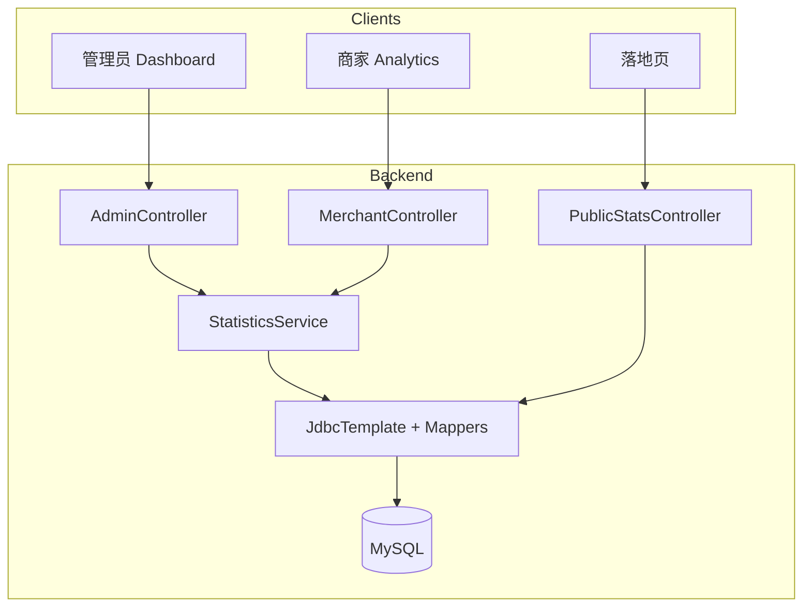
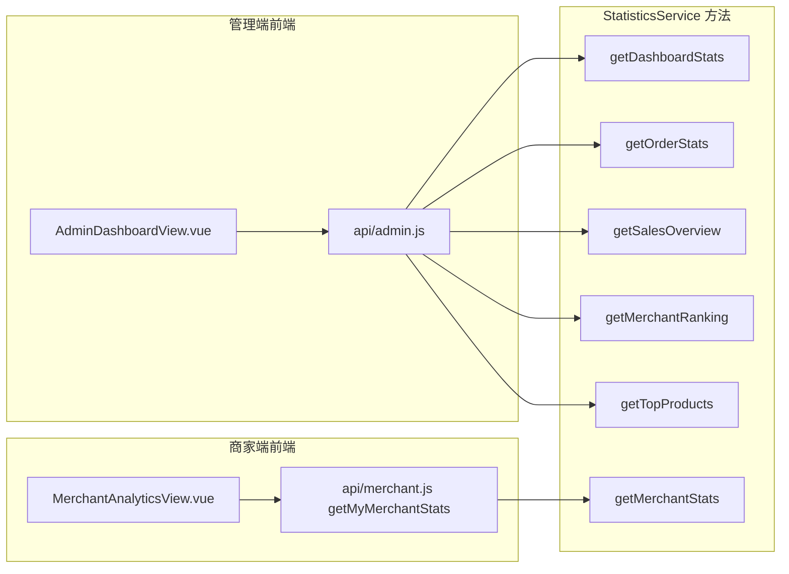
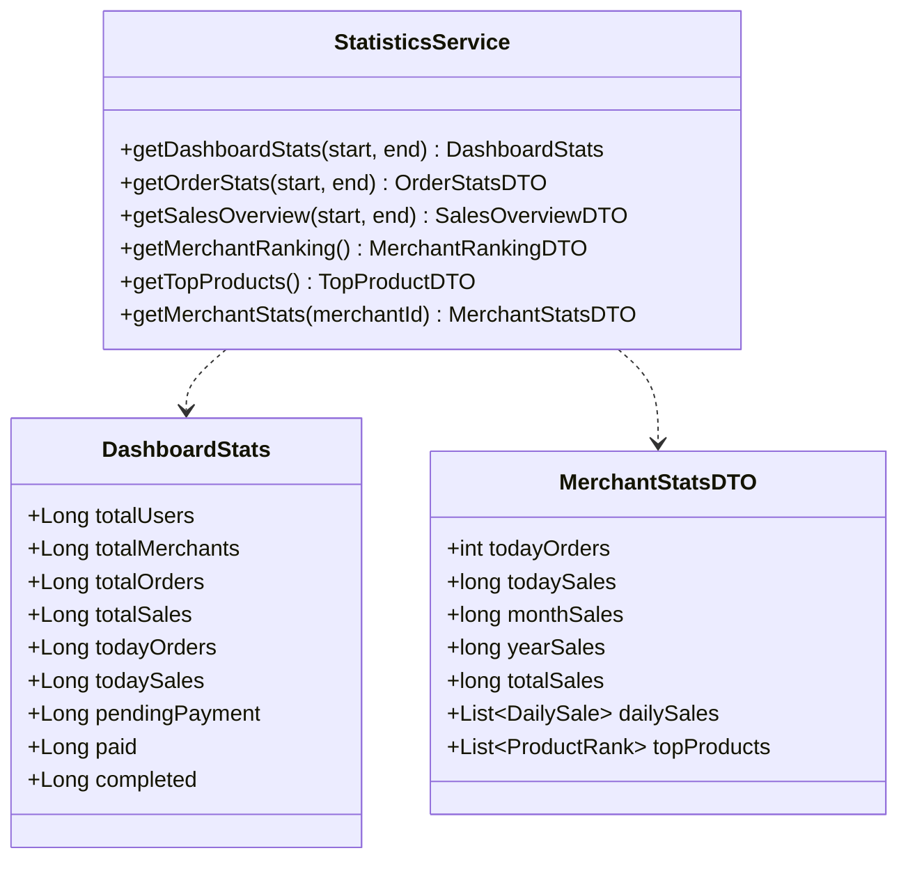
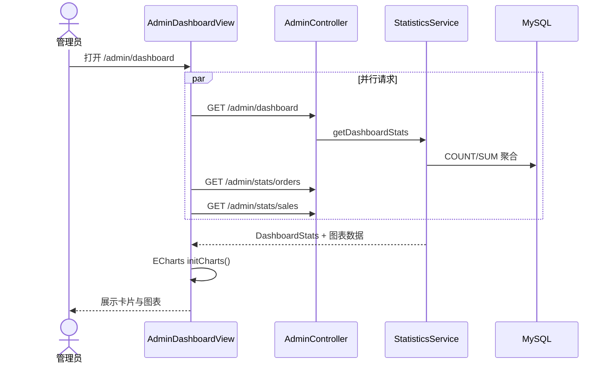

# UC15 经营统计分析

| 属性 | 内容 |
| --- | --- |
| **用例编号** | UC15 |
| **用例名称** | 经营统计分析 |
| **负责人** | 成员 E（测试质量 / 用例文档） |
| **关联需求** | REQ-STAT-01 平台经营看板；REQ-STAT-02 商家经营分析 |
| **文档版本** | V1.1 |
| **编写日期** | 2026-08-25 |
| **机测日期** | 2026-08-28 |

---

## 1. 需求说明

CLAS 需要提供两类经营统计能力：

1. **平台级（管理员）**：汇总用户/商家/订单/销售额，展示订单状态分布、销售趋势、商家排行、热销商品；支持日期区间筛选与大屏模式。
2. **店铺级（商家）**：本店今日/本月/本年/累计营业额、订单数、近 7 日销售曲线、热销商品 Top N。
3. **公开级（可选）**：落地页展示平台规模（营业商家数、在售商品数、用户数），无需登录。

**业务价值**：支撑管理决策与商家自助运营分析，满足课程「经营统计」与 ECharts 可视化验收。

---

## 2. 用例说明

### 2.1 参与者

| 参与者 | 说明 |
| --- | --- |
| **管理员（ADMIN）** | 查看全平台仪表盘与统计 API |
| **商家（MERCHANT）** | 查看本店经营数据（`/merchant/analytics`） |
| **访客** | 查看公开统计（`/api/public/stats`） |
| **系统** | `StatisticsService` 聚合 MySQL 数据；前端 ECharts 渲染 |

### 2.2 触发条件

- **UC15-A 管理员打开仪表盘**：访问 `/admin/dashboard` 或调用统计 API。
- **UC15-B 商家查看分析**：访问 `/merchant/analytics`。
- **UC15-C 公开统计**：落地页加载时请求 `/api/public/stats`。

### 2.3 前置条件

| 场景 | 前置条件 |
| --- | --- |
| 管理端统计 | 管理员已登录 |
| 商家统计 | 商家已登录且已完成入驻（存在 `merchant` 记录） |
| 公开统计 | 无 |
| 有效数据 | `orders`、`payment`、`product` 等表含历史订单（种子数据即可） |

### 2.4 主成功流程

**UC15-A 管理员查看经营仪表盘**

1. 管理员登录后默认跳转 `/admin/dashboard`（`AdminDashboardView.vue`）。
2. 页面默认日期区间为近 7 天，并行请求：
   - `GET /api/admin/dashboard?startDate=&endDate=`
   - `GET /api/admin/stats/orders?...`
   - `GET /api/admin/stats/sales?...`
   - `GET /api/admin/stats/merchants`
   - `GET /api/admin/stats/products`
3. `StatisticsService.getDashboardStats` 聚合：总用户/商家/订单/销售额、区间内订单与销售额、待支付/已支付/已完成订单数。
4. 前端渲染 4 张汇总卡片、筛选区间概览（含 `pendingPaymentOrders`、`paidOrders`）、ECharts 订单状态饼图、销售趋势、商家排行、热销商品。
5. 管理员可切换日期区间，点击「大屏模式」全屏展示；系统每 30 秒自动刷新（前端定时器）。

**UC15-B 商家查看本店经营分析**

1. 商家登录，进入 **经营分析**（`/merchant/analytics`，页面标题「经营分析」）。
2. 并行请求 `GET /api/merchant/my`、`GET /api/merchant/my/stats`。
3. `StatisticsService.getMerchantStats(merchantId)` 计算：今日订单/销售额、月/年/累计销售额、近 7 日每日销售、热销商品 Top。
4. 页面展示营业额切换（日/月/年/总）与 ECharts 折线+柱状图。

**UC15-C 公开统计（落地页）**

1. 访客打开 `landing.html`。
2. 请求 `GET /api/public/stats`（`PublicStatsController`）。
3. 返回 `{ merchants, products, users }` 计数（商家仅统计 `OPEN` 状态）。

### 2.5 备选流程与异常流程

| 编号 | 条件 | 系统行为 | 可验证结果 |
| --- | --- | --- | --- |
| UC15-E1 | 普通用户访问 `/api/admin/dashboard` | RBAC | HTTP **403**（机测 UC15-API-02） |
| UC15-E2 | 未入驻用户访问 `/api/merchant/my/stats` | 无 merchant 记录 | HTTP 400，提示未入驻 |
| UC15-E3 | 区间内无订单 | 图表空数据 | 页面显示 0 或空态，不报错 |
| UC15-E4 | 统计 API 超时/失败 | 前端 catch | ElMessage「加载仪表盘数据失败」 |
| UC15-A1 | 仅传 startDate | `resolveRange` 默认 endDate=今天 | 区间有效 |
| UC15-A2 | 大屏模式 | `fullscreen` CSS 类 | 全屏布局，时钟显示 |

### 2.6 可验证结果（验收标准）

- [x] 管理员 dashboard 返回 `totalUsers/totalMerchants/totalOrders/totalSales` 等字段。（UC15-API-01）
- [x] 订单统计、销售统计 API 可访问。（UC15-API-03）
- [x] 商家本店统计含 `todayOrders/todaySales/totalSales/dailySales`。（UC15-API-04，机测 todaySales=0 为数据现状）
- [x] 公开统计无需登录，2026-08-28 实测 merchants=113, products=622, users=406。（UC15-API-05）
- [x] USER 访问 dashboard 返回 **403**。（UC15-API-02）
- [ ] ECharts 渲染与大屏模式待浏览器手工截图。（UC15-MAN-01/02）

---

## 3. 设计图

### 3.1 系统级图



### 3.2 组件级图



### 3.3 对象级图（统计 DTO）



### 3.4 活动图（管理员加载仪表盘）



---

## 4. 代码映射

| 层次 | 路径 | 职责 |
| --- | --- | --- |
| 统计服务 | `backend/.../service/StatisticsService.java` | 全部聚合 SQL / Mapper |
| 管理 API | `backend/.../controller/AdminController.java` | `/dashboard`, `/stats/*` |
| 商家 API | `backend/.../controller/MerchantController.java` | `GET /api/merchant/my/stats` |
| 公开 API | `backend/.../controller/PublicStatsController.java` | `GET /api/public/stats` |
| DTO | `backend/.../dto/DashboardStats.java` 等 | 响应结构 |
| 管理仪表盘 | `frontend/src/views/admin/AdminDashboardView.vue` | ECharts + 大屏 + 自动刷新 |
| 商家分析 | `frontend/src/views/MerchantAnalyticsView.vue` | 本店图表 |
| 前端 API | `frontend/src/api/admin.js`, `merchant.js` | 封装统计请求 |
| 路由 | `frontend/src/router/index.js` | `/admin/dashboard`, `/merchant/analytics` |

**统计 API 清单**

| 接口 | 角色 | 说明 |
| --- | --- | --- |
| `GET /api/admin/dashboard` | ADMIN | 汇总卡片 |
| `GET /api/admin/stats/orders` | ADMIN | 状态分布 + 日趋势 |
| `GET /api/admin/stats/sales` | ADMIN | 销售趋势 |
| `GET /api/admin/stats/merchants` | ADMIN | 商家排行 Top10 |
| `GET /api/admin/stats/products` | ADMIN | 热销商品 Top10 |
| `GET /api/merchant/my/stats` | MERCHANT | 本店经营数据 |
| `GET /api/public/stats` | 公开 | 平台规模计数 |

---

## 5. 测试映射与结果

> **机测环境**：生产 `http://8.141.112.182`  
> **机测时间**：2026-08-28  
> **结果归档**：[`uc13-15-api-results.json`](./uc13-15-api-results.json)

| 测试编号 | 类型 | 对应用例步骤 | 测试位置 | 状态 | 机测证据 |
| --- | --- | --- | --- | --- | --- |
| UC15-API-01 | API | ADMIN dashboard 统计字段 | `run_uc13_15_api_test.py` | ✅ PASS | 含 totalUsers 等 |
| UC15-API-02 | API | USER 访问 dashboard → 403 | 同上 | ✅ PASS | status=403 |
| UC15-API-03 | API | ADMIN `/stats/orders` | 同上 | ✅ PASS | status=200 |
| UC15-API-04 | API | MERCHANT `/my/stats` | 同上 | ✅ PASS | todaySales=0 |
| UC15-API-05 | API | 公开 `/public/stats` | 同上 | ✅ PASS | merchants=113 |
| UC15-MAN-01 | 手工 | 仪表盘 ECharts + 大屏 | TC-F-028 | 📋 待执行 | — |
| UC15-MAN-02 | 手工 | 商家经营分析页 | — | 📋 待执行 | — |

**执行命令**

```bash
python docs/use-cases/run_uc13_15_api_test.py
```

---

## 6. 追溯矩阵

| 需求项 | 设计要素 | 代码 | 测试 |
| --- | --- | --- | --- |
| 平台汇总 | 活动图 3.4 | `getDashboardStats` | UC15-API-01 ✅ |
| 订单状态分布 | 组件级 ECharts 饼图 | `getOrderStats` | UC15-API-03 ✅ |
| 本店分析 | MerchantAnalyticsView | `getMerchantStats` | UC15-API-04 ✅ |
| 权限 | RBAC | `@RequireRole` | UC15-API-02 ✅ |
| 公开统计 | PublicStatsController | `/api/public/stats` | UC15-API-05 ✅ |

---

## 7. 演示步骤（中期检查）

1. 管理员登录 → **管理后台 / 仪表盘**，截图 4 张卡片 + 销售趋势图。
2. 切换日期为近 30 天，确认「筛选区间订单」数值变化。
3. 点击「大屏模式」，截图全屏界面。
4. 商家 `13800000002` 登录 → **经营分析**，截图营业额与图表。
5. Postman：`GET http://8.141.112.182/api/public/stats`，确认 `code=200` 且含 `merchants/products/users`。
