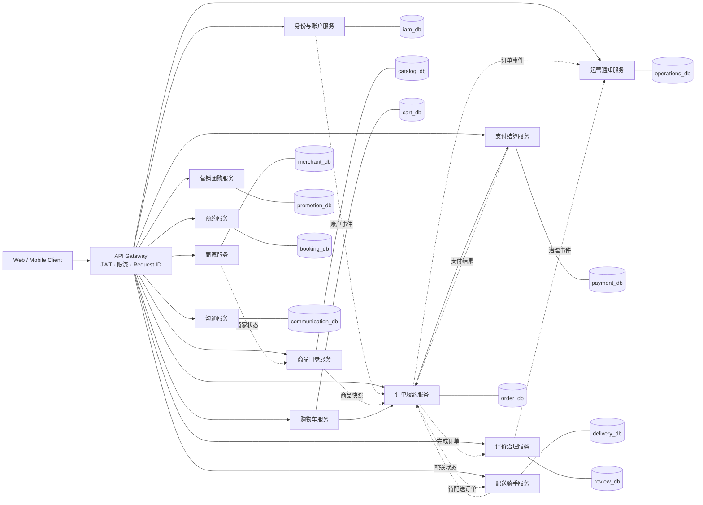

# CLAS 微服务划分、接口与数据归属方案

> 状态：目标架构蓝图；当前可运行实现为 `services/clas-iam`、`services/clas-catalog`、`services/clas-order` 与 `services/clas-compat`。本文件的 12 服务划分是后续演进目标，不应与当前四服务部署混用。
> 基线：提交 `15355196f0a18fdaa9e79b88da3480ef09c4fab9` 及其后的 `main`。
> 本文定义从当前单体应用演进到微服务的目标蓝图，不改变当前生产运行方式。

## 1. 当前状态与约束

当前生产形态是 **Vue 前端 + 单个 Spring Boot `backend` + MySQL + Redis**。k3s 清单中只有一个
`backend` Deployment，因此它不是已经完整拆分完成的微服务系统。当前目录能力以 `services/clas-catalog`
实现并由 `services/nginx/clas-gateway.conf` 路由；下图中的其余服务仍是稳定的领域边界和后续可独立部署单元。迁移期间仍可先在同一代码仓、同一 MySQL 实例中按 schema 隔离。

- 每张业务表只有一个主写服务（owner）；其它服务只可通过 API、事件投影或只读副本使用数据。
- `userId`、`merchantId`、`orderId` 等仅作为跨服务引用，不建立跨服务外键。
- 同步链路使用 HTTP/gRPC；状态变化使用可靠事件（Outbox 后再引入消息队列），禁止分布式事务。
- 网关统一完成 JWT 校验、限流、请求 ID 与路由；服务仍须校验资源归属和角色权限。

## 2. 目标微服务划分图

## 3. 服务职责与拆分顺序

| 服务 | 职责 | 当前代码入口 | 拆分优先级 |
| --- | --- | --- | --- |
| 身份与账户 | 登录、会话、角色、个人资料、地址、银行卡 | `User*Controller`、`AddressController` | 0：先保持模块化 |
| 商家 | 入驻、审核、商家资料与营业状态 | `MerchantController` | 1 |
| 商品目录 | 分类、商品、图片、库存查询 | `services/clas-catalog` | 当前四服务实现 |
| 购物车 | 加减商品、失效校验 | `CartController` | 2 |
| 订单履约 | 下单、状态机、退款争议、时间线 | `OrderController` | 1 |
| 支付结算 | 模拟支付、骑手小费、结算、提现 | `PaymentController`、`RiderWithdrawalService` | 2 |
| 营销团购 | 优惠券、团购售卖和核销 | `CouponController`、`DealController` | 2 |
| 预约 | 服务预约与状态流转 | `BookingController` | 3 |
| 配送骑手 | 骑手档案、任务、取餐/送达、定位、绩效 | `Rider*Controller`、`DeliveryTrackingController` | 1 |
| 沟通 | 会话、订单聊天、隐私通话会话 | `ChatController`、`RiderMerchantContactController` | 3 |
| 评价治理 | 评价、图片、回复、投票、举报与删除申请 | `ReviewController` | 2 |
| 运营通知 | 公告、站内通知、处罚、申诉、后台聚合 | `AnnouncementController`、`NotificationController`、`AdminController` | 2 |

优先级 0 不是立即拆服务：先将边界固定在代码、接口和数据归属上；优先级 1 服务只在独立扩缩容或
独立发布有明确收益时才拆，避免把课程演示系统过早变为难以维护的分布式系统。

## 4. 服务接口清单

所有接口保留 `/api` 前缀，生产访问经网关；除健康检查、公开浏览、注册/登录相关接口外，均要求
`Authorization: Bearer <JWT>`。下表是当前 Controller 路由按目标服务归类后的完整接口族清单；`…`
表示同一资源的明确子路径，不表示未定义的通配接口。

| 服务 | 当前接口族（HTTP 方法与路径） | 主要调用方 |
| --- | --- | --- |
| 身份与账户 | `POST /user/login`、`/user/demo-login`、`/user/demo-access/verify`、`/user/register`、`/user/register/send-code`、`/user/forgot-password/send-code`、`/user/forgot-password/reset`、`/user/login/send-code`、`/user/switch-role`、`/user/logout`；`GET /user/login-notice`；`GET/PUT /user/profile`、`POST /user/phone-change/send-code`、`PUT /user/phone`、`PUT /user/password`、`POST /user/roles/cancel`、`POST /user/account/cancel`、`POST /user/profile/avatar`；`GET/POST/DELETE /user/bank-cards[/{id}]`；`GET/POST/PUT/DELETE /address/mine|/{id}`、`POST /address/{id}/default`；`GET/POST/DELETE /favorites/mine|/{merchantId}` | 全部端 |
| 商家 | `GET /merchant/list`、`GET /merchant/{id}`、`GET /merchant/{id}/delivery-estimate`；`POST /merchant/register`、`POST /merchant/register/send-code`；`GET /merchant/my`、`POST /merchant/my/logo`、`POST /merchant/my/profile/send-*-code`、`PUT /merchant/my/profile`、`POST /merchant/my/manual-closed/toggle`、`GET /merchant/my/audit-status`、`GET /merchant/my/stats`；`GET /merchant/admin/list`、`POST /merchant/admin/audit/{id}`、`GET /merchant/admin/audit-logs/{id}` | 用户、商家、运营 |
| 商品目录 | `GET /product/list[/{merchantId}]`、`GET /product/categories`；内部 `GET /internal/catalog/v1/products/{productId}`、`POST /internal/catalog/v1/products/availability`。商家写入接口在网关切流前保留于单体兼容层，订单只能调用内部目录 API。 | 用户、商家、订单 |
| 购物车 | `POST /cart/add`、`POST /cart/remove`、`POST /cart/update`；`GET /cart/list/{userId}`、`GET /cart/me`、`GET /cart/validate/{userId}`、`GET /cart/me/validation`；`DELETE /cart/item/{userId}/{productId}`、`DELETE /cart/me/items/{productId}`、`DELETE /cart/invalid/{userId}`、`DELETE /cart/me/invalid`、`DELETE /cart/clear/{userId}`、`DELETE /cart/me` | 用户、订单 |
| 订单履约 | `POST /order/create`、`POST /order/create-batch`、`GET /order/preview`；`GET /order/list/{userId}`、`GET /order/me`、`GET /order/{id}`、`GET /order/{id}/timeline`、`GET /order/merchant/{merchantId}`、`GET /order/merchant/me`、`GET /order/merchant/me/user/{userId}`、`GET /order/merchant/detail/{id}`、`GET /order/admin/{id}`；`POST /order/accept/{id}`、`/order/ready-for-dispatch/{id}`、`/order/complete/{id}`、`/order/cancel/{id}`、`/order/reject/{id}`、`/order/deliver/{id}`；`POST /order/refund/{id}`、`/order/refund/{id}/approve`、`/order/refund/{id}/reject`、`/order/refund/{id}/dispute` | 用户、商家、配送、运营 |
| 支付结算 | `POST /payment/mock`、`POST /payment/mock/batch`、`GET /payment/status/{orderId}`、`GET /payment/status/batch`；`POST /order/pay/{id}`（兼容入口）；`POST /order/{id}/rider-tip` | 用户、订单、配送 |
| 营销团购 | `GET /coupon/claimable`、`POST /coupon/claim/{id}`、`GET /coupon/mine`；`GET /deals`、`GET /deals/{id}`、`GET /deals/merchant`、`POST /deals/merchant`、`PUT /deals/merchant/{id}`、`POST /deals/{id}/buy`、`GET /deals/mine`、`POST /deals/redeem`、`GET /deals/redeem-logs`、`GET /deals/orders/{id}/payment-status`、`POST /deals/orders/{id}/pay`、`POST /deals/orders/{id}/refund` | 用户、商家、支付 |
| 预约 | `POST /bookings`、`GET /bookings/mine`、`POST /bookings/{id}/cancel`、`GET /bookings/merchant`、`POST /bookings/{id}/status` | 用户、商家 |
| 配送骑手 | `GET /rider/orders/available`、`GET /rider/orders/me`、`POST /rider/orders/{id}/claim`；`POST /rider/applications`、`GET /rider/application`、`GET/PUT /rider/info`、`GET /rider/profile`、`POST /rider/info/service-phone-change`、`PATCH /rider/online`、`POST /rider/work/start`、`POST /rider/work/end`、`PUT /rider/location`、`GET /rider/tasks`、`POST /rider/tasks/{id}/claim`、`GET /rider/deliveries`、`PUT /rider/deliveries/sequence`、`POST /rider/deliveries/{id}/pickup`、`/complete`、`/abandon`、`GET /rider/deliveries/{id}/detail`；`GET /delivery/orders/{id}/tracking`；`POST/GET /rider/withdrawals`、`GET /rider/reviews`、`GET /rider/metrics`、`GET /rider/settlements`；`GET /rider/admin/withdrawals`、`PATCH /rider/admin/withdrawals/{id}`、`GET /rider/admin/applications`、`GET /rider/admin/info-change-requests`、`PATCH /rider/admin/info-change-requests/{id}`、`PATCH /rider/admin/applications/{id}`、`GET/PATCH /rider/admin/riders/{riderId}`、`GET /rider/admin/riders/{riderId}/identity` | 骑手、订单、运营 |
| 沟通 | `POST /chat/send`、`POST /chat/consult/{merchantId}`、`GET /chat/order/{orderId}`、`GET /chat/merchant/{merchantId}`、`GET /chat/with/{merchantId}`、`GET /chat/conversations`、`GET /chat/admin/merchants`、`GET /chat/admin/merchant/{merchantId}/users`、`GET /chat/admin/merchant/{merchantId}/user/{userId}`；`GET/POST /delivery/orders/{id}/merchant-messages`；`GET/POST /rider/deliveries/{id}/messages`、`POST /rider/deliveries/{id}/call-session` | 用户、商家、骑手、运营 |
| 评价治理 | `POST /review/add`、`GET /review/order/{id}`、`GET /review/mine`、`GET /review/merchant/{id}`、`GET /review/rating/{id}`、`POST /review/{id}/comments`、`POST /review/{targetType}/{targetId}/vote`、`DELETE /review/{id}`、`DELETE /review/reply/{id}`、`POST /review/{id}/delete-request`、`POST /review/{id}/report`、`POST /review/reply/{id}/report`、`POST /review/upload`；`POST /order/{id}/rider-review`、`GET /order/{id}/rider-review`、`GET /rider/reviews` | 用户、商家、骑手、运营 |
| 运营通知 | `GET /notifications/mine`、`POST /notifications/{id}/read`、`POST /notifications/read-all`、`DELETE /notifications/{id}`、`DELETE /notifications/all`；`GET /announcement/list`、`GET /announcement/admin/list`、`POST /announcement/create`、`PUT/DELETE /announcement/{id}`；`GET /user/penalties/mine`、`POST /user/appeals`、`GET /user/appeals/mine`；`GET /admin/dashboard`、`/admin/stats/*`、`/admin/orders`、`/admin/users`、`/admin/reviews`、`/admin/appeals`、`/admin/order-refund-disputes`、`/admin/export/*` 及对应审核/处罚写接口 | 全部端、运营 |
| 平台 | `GET /health`、公开统计接口 `/public/**` | 网关、监控、落地页 |

兼容性规则：已有路径在服务拆分时仍由网关保持不变；新内部 API 使用
`/internal/{service}/v1/**`，不得直接暴露服务数据库或绕过网关。

## 5. 数据表归属方案

“归属”是唯一写入权，而不是表中是否保存其它领域的 ID。当前所有表仍在一个 MySQL `clas` 库中；拆分时按
下表迁移到服务私有 schema/数据库，并以 Outbox 事件发布状态变化。

| 主写服务 | 表 | 允许的跨服务使用 |
| --- | --- | --- |
| 身份与账户 | `user`, `user_role`, `user_address`, `user_bank_card`, `favorite` | 提供账户、已审批角色和脱敏资料查询；不允许他服务更新账号、银行卡或用户收藏 |
| 商家 | `merchant`, `merchant_audit_log` | 目录、订单、配送只读取商家状态/快照 |
| 商品目录 | `product_category`, `product` | 订单在创建时读取并固化商品名称、价格快照；不跨库扣减库存 |
| 购物车 | `cart` | 订单只调用“读取并清空购物车”命令 |
| 订单履约 | `orders`, `order_item`, `order_lifecycle_event`, `order_refund_dispute` | 支付、配送、评价使用订单查询和状态事件；只有订单服务转换订单状态 |
| 支付结算 | `payment`, `rider_tip`, `rider_settlement`, `rider_withdrawal` | 订单只接收支付结果；配送只读取已结算/提现状态 |
| 营销团购 | `coupon`, `user_coupon`, `group_deal`, `deal_order`, `deal_redeem_log` | 订单/支付调用核销和权益冻结接口，不能直接改券或团购订单 |
| 预约 | `service_booking` | 商家、运营通过预约 API 查看和变更状态 |
| 配送骑手 | `rider_application`, `rider_profile`, `rider_audit_log`, `rider_profile_change_request`, `rider_location_history`, `delivery_exception`, `delivery_call_session`, `rider_review`, `rider_daily_metrics` | 订单提供待配送快照；配送发布骑手领取、取餐、送达与异常事件 |
| 沟通 | `chat_conversation`, `chat_message` | 订单、商家和骑手只传入授权后的会话/订单上下文 |
| 评价治理 | `review`, `review_image`, `review_reply`, `review_vote`, `review_user_hidden`, `deleted_review_backup`, `review_delete_request` | 订单发布“已完成”；运营接收举报、删除申请与审核事件 |
| 运营通知 | `notification`, `announcement`, `user_penalty`, `appeal`, `role_application` | 其它服务消费通知/处罚/角色审核结果；运营聚合数据使用 API 或只读投影 |
| 平台迁移 | `migration_history` | 只由部署迁移 Job 写入；不属于业务服务 |

## 6. 跨服务一致性契约

| 业务动作 | 命令服务 | 事件 / 订阅者 | 一致性要求 |
| --- | --- | --- | --- |
| 创建订单 | 订单履约 | `OrderCreated` → 支付、运营 | 订单项与金额在订单库事务内固化 |
| 支付完成 | 支付结算 | `PaymentSucceeded` → 订单、运营 | 以支付幂等键去重；订单服务单向推进状态 |
| 订单待配送 | 订单履约 | `OrderReadyForDispatch` → 配送 | 配送领取使用订单版本/领取令牌防止双抢 |
| 骑手送达 | 配送骑手 | `DeliveryCompleted` → 订单、结算、运营 | 订单服务校验当前状态后完成订单 |
| 订单完成 | 订单履约 | `OrderCompleted` → 评价、营销、运营 | 评价和券核销只能消费一次 |
| 处罚/角色审核 | 运营通知 | `AccountRestricted` / `RoleApproved` → 身份与账户、相关服务 | 权限变更须立即使旧会话失效或重新鉴权 |

## 7. 实施验收标准

- 12 个领域服务均有单一职责、外部接口族和唯一主写表集合。
- 全部业务实体表和迁移表均已分配 owner，没有共享可写表。
- 订单、支付、配送、评价、处罚五条跨服务链路均定义了命令方、事件和幂等边界。
- 现有接口路径通过网关兼容，前端不因后端物理拆分而同步改版。

真正实施时再增加：每服务独立 Deployment、私有数据库凭据、Outbox、契约测试、分布式追踪和监控告警。

## 8. 关联源码

- HTTP 接口：`backend/src/main/java/com/clas/controller/`
- 当前业务实现：`backend/src/main/java/com/clas/service/`
- 数据库基线与增量迁移：`database/schema.sql`、`database/migration-*.sql`
- 当前单体部署：`k8s/backend.yaml`、`k8s/mysql.yaml`、`k8s/redis.yaml`
