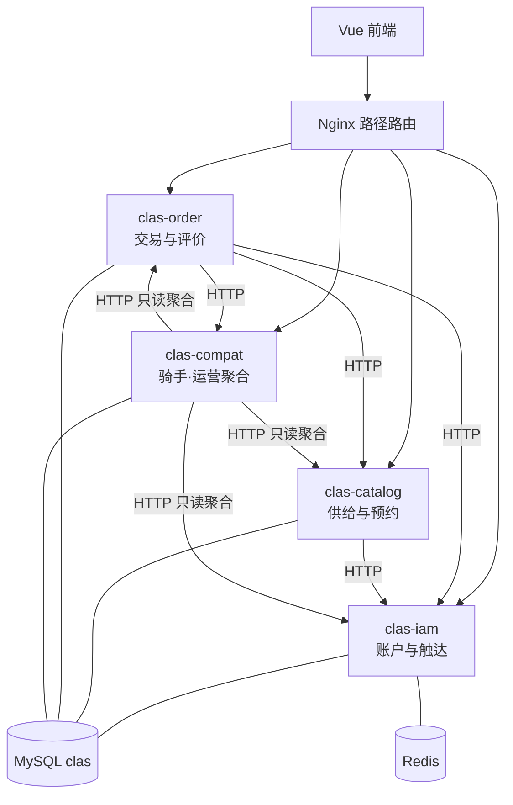

# CLAS 三业务微服务 + compat 划分图

> 状态：定稿（2026-08-31）。至少 3 个**业务**微服务；compat 为过渡聚合层，**不计入**业务服务数量。  
> 网关：前端 Nginx 按路径反代（不算业务微服务）。

## 1. 划分原则

- **最大归属**：概念上归属清晰的模块并入 iam / catalog / order。
- **不硬塞**：骑手配送、管理聚合等独立域暂留 compat，后续可演进为第 4 服务。
- **一表一主写**：其他服务只走 HTTP 内部接口，禁止跨库 JOIN。

## 2. 架构图

## 3. 三个业务微服务职责

| 服务 | 端口 | 负责业务 | 为何独立 |
| --- | --- | --- | --- |
| **clas-iam** | 8081 | 注册登录、资料、地址、收藏、银行卡、站内通知、角色申请、用户侧处罚/申诉 | 身份是全系统入口，与交易解耦 |
| **clas-catalog** | 8082 | 商家入驻/审核、商品、**团购发布**、**服务预约**、商品/商家图片 | 供给与读多写少的目录域 |
| **clas-order** | 8083 | 购物车、订单、支付、退款、**团购购买/核销**、**优惠券**、**订单评价** | 核心交易写路径与状态机 |

## 4. compat 职责（有内容、不硬并）

| 模块 | 说明 |
| --- | --- |
| 骑手 / 配送 UC16 | 独立域，表多，与 order 双向联动；不强行并入 order |
| `/api/admin` | 跨三服务只读聚合、导出 |
| `/api/announcement` | 平台公告 |
| 部分监管/统计只读 | 通过 HTTP 调三服务，不主写业务表 |

## 5. 改造版本

| 版本 | Git | 部署形态 |
| --- | --- | --- |
| 改造前 | 标签 `monolith-start` | 单个 `backend` |
| 改造后 | `main` 微服务提交 | iam + catalog + order + compat + Nginx 路由 |
