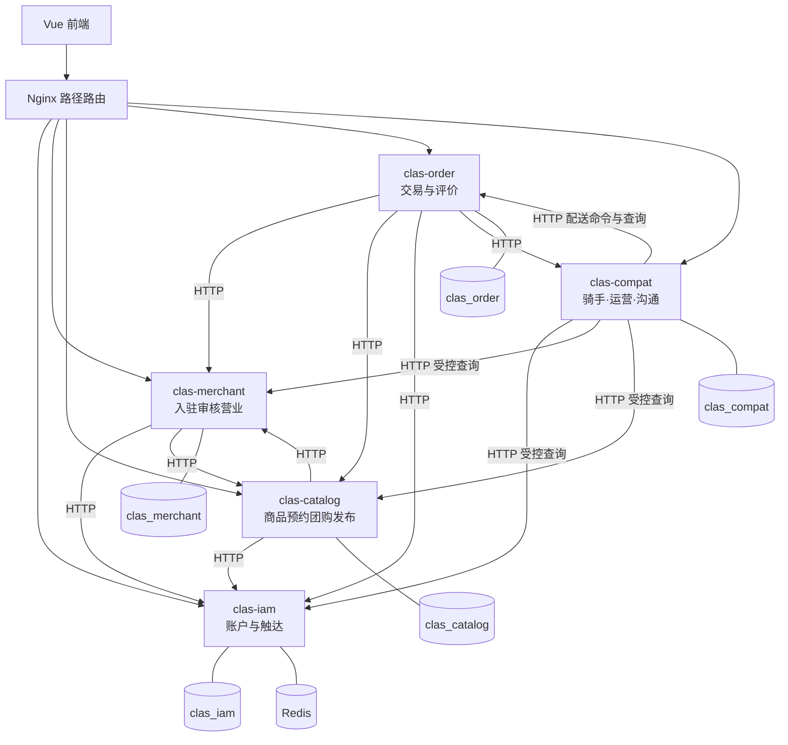

# CLAS 业务微服务 + compat 划分图

> 状态：当前实现（2026-09-02）。  
> 课程「至少三项业务微服务」计：`clas-iam`、`clas-catalog`、`clas-order`；**`clas-merchant` 为 #38 已拆出的第四项业务服务**；`clas-compat` 仅为过渡层（骑手/Admin/公告/聊天），不计入三项数量。  
> 网关：Nginx 路径反代（不算业务微服务）。  
> **#36**：compat 跨域 Mapper 已清零；Admin/统计/骑手/处罚均走内部 API。P3 已 MOVE 到各服务私有库，并用 `clas_*_app` 最小权限账号。

## 1. 划分原则

- **一表一主写**：其他服务只走 HTTP 内部接口，禁止跨库 JOIN。
- **商家独立**：入驻、审核、资料、营业状态由 `clas-merchant` 主写；商品/预约/团购发布留在 `clas-catalog`。
- **不硬塞**：骑手配送、运营与沟通保持为独立 compat 服务。

## 2. 架构图

## 3. 业务微服务职责

| 服务 | 端口 | 负责业务 | 为何独立 |
| --- | --- | --- | --- |
| **clas-iam** | 8081 | 注册登录、资料、地址、收藏、银行卡、站内通知、角色申请、用户侧处罚/申诉 | 身份是全系统入口 |
| **clas-merchant** | 8085 | 商家入驻、审核、资料、营业/配送状态、Logo | #38 商家状态调用链；表 `merchant` / `merchant_audit_log` 唯一写服务 |
| **clas-catalog** | 8082 | 商品、分类、**团购发布**、**服务预约**、商品图片 | 供给目录，商家身份经 merchant 内部 API |
| **clas-order** | 8083 | 购物车、订单、支付、退款、**团购购买/核销**、**优惠券**、**订单评价** | 核心交易写路径与状态机 |

## 4. compat 职责（过渡层）

| 模块 | 说明 |
| --- | --- |
| 骑手 / 配送 UC16 | 独立域，表多，与 order 双向联动 |
| `/api/admin` | 跨服务聚合、导出 |
| `/api/announcement` | 平台公告 |
| 沟通 | 主写会话/消息表 |

## 5. 改造版本

| 版本 | Git | 部署形态 |
| --- | --- | --- |
| 改造前 | 标签 `monolith-start` | 单个 `backend` |
| 四进程 | `main` 早期微服务提交 | iam + catalog（含商家）+ order + compat |
| 商家拆分 | `51e45fb` | iam + **merchant** + catalog + order + compat + Nginx 路由 |

## 6. 服务发现

| 环境 | 方式 |
| --- | --- |
| 本地 | 固定端口 + Nginx `127.0.0.1:8080` → `8081/8085/8082/8083/8084`；服务间 `CLAS_*_HOST=localhost` |
| Kubernetes | DNS：`clas-iam:8081`、`clas-merchant:8085`、`clas-catalog:8082`、`clas-order:8083`、`clas-compat:8084`（`k8s/microservices.yaml`）；`CLAS_*_HOST` 注入同名 Service |

旧 `services/catalog-service/` 为弃用原型，不纳入构建/网关/K8s。
