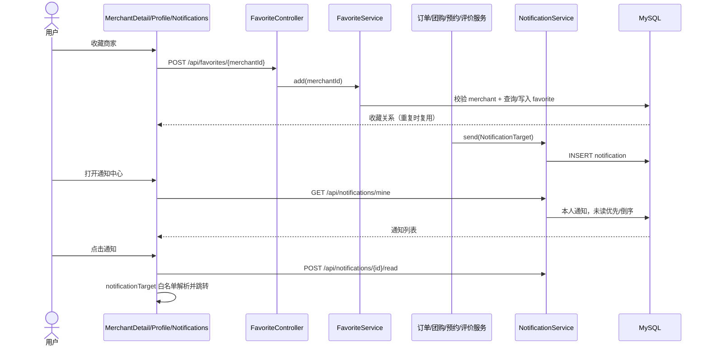
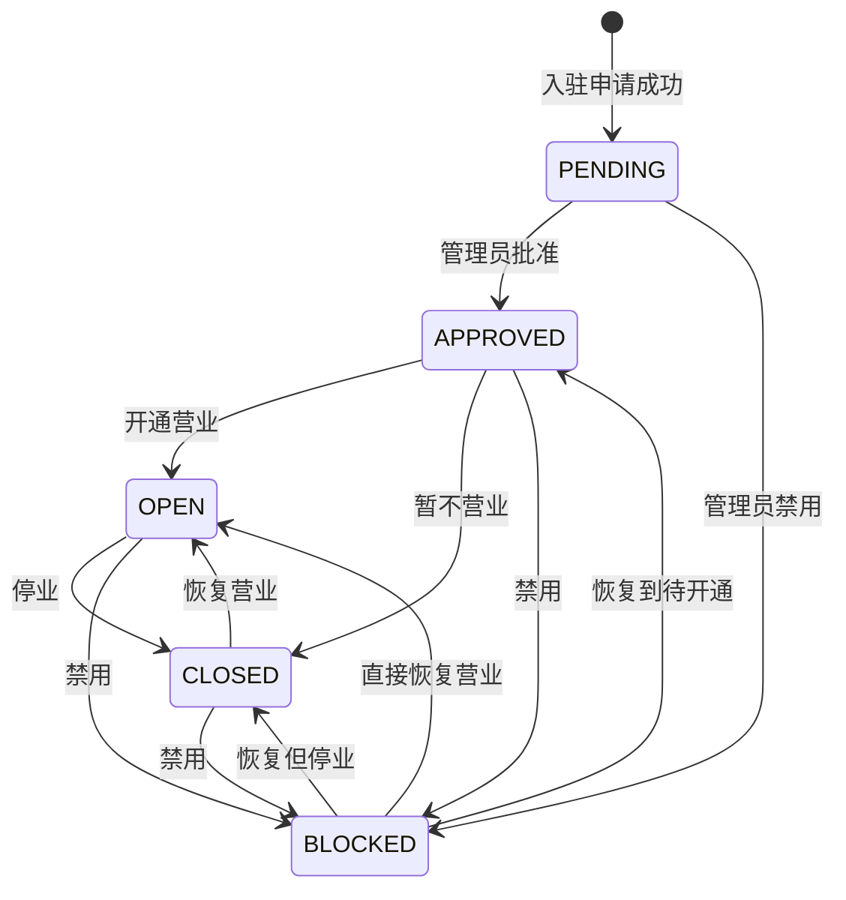
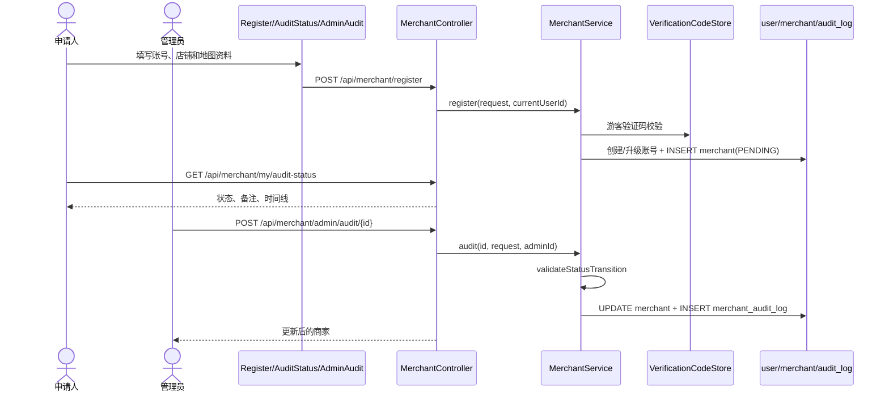
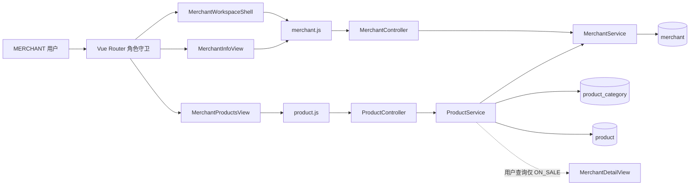
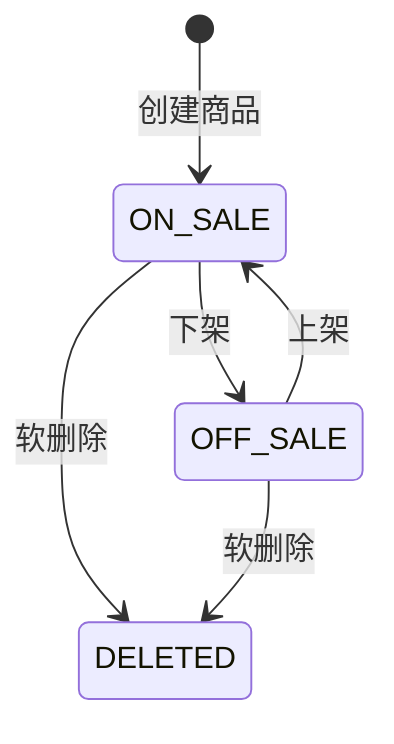
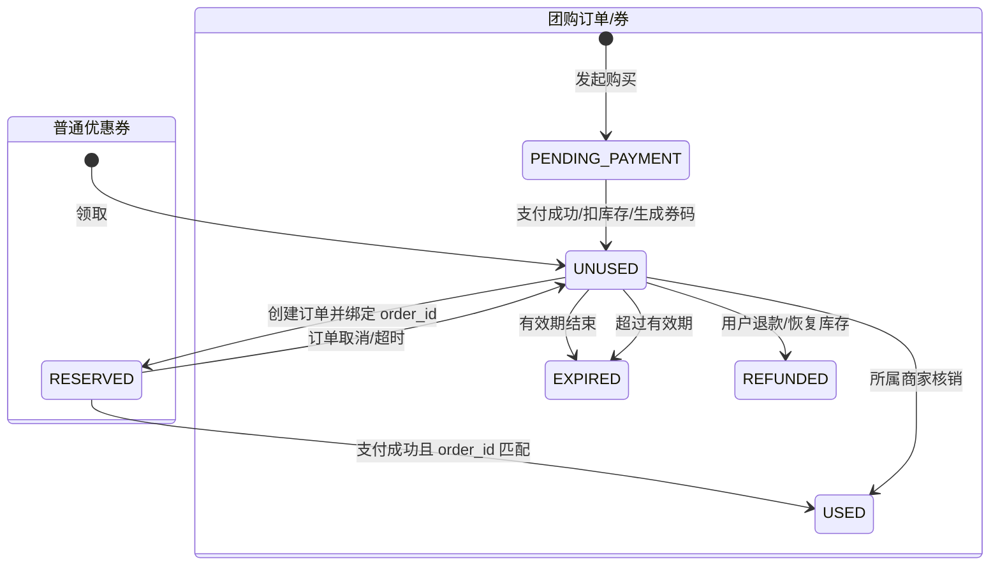
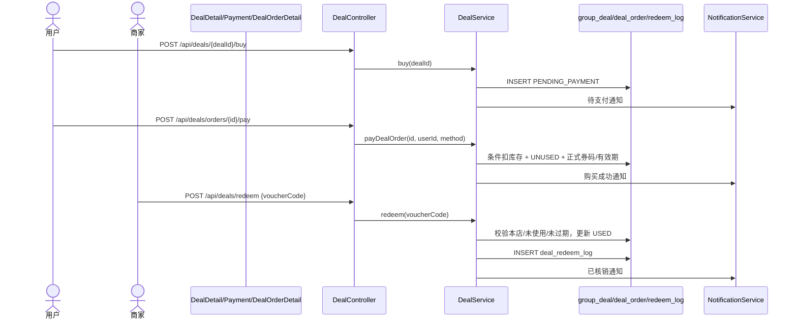

# UC05–UC08 详细设计、测试设计与追溯记录

## Context

CLAS is a Spring Boot 3 + MyBatis Plus + MySQL/Redis backend with a Vue 3 + Vite frontend. UC05–UC08 are already represented in production code, but their requirements, diagrams, code symbols, and verification evidence were scattered across README sections, historical reports, source files, and several test suites.

This document is a documentation baseline dated 2026-08-25. It describes the repository state inspected in this change. No runtime code or test code is modified, and no test command is executed.

Stakeholders are the feature owner, reviewer, developer, tester, and future maintainer. The controlling use-case requirements are the five specs beside this design.

## Goals / Non-Goals

**Goals:**

- Make each use case reviewable from requirement to design, code, data, and test.
- Use stable identifiers: `UCxx-Ryy` (requirement), `UCxx-Fyy/Ayy/Vyy` (flow/result), `Dxx` (diagram), `Cxx` (code component), and `UT/API/E2E-UCxx-nn` (test).
- Describe existing evidence accurately and identify gaps for later test implementation.
- Provide enough run-readiness information for a tester to reproduce the flows later.

**Non-Goals:**

- Do not change APIs, database tables, frontend behavior, or implementation code.
- Do not add automated tests or claim that existing tests passed in this phase.
- Do not redesign current business rules, integrate a real payment gateway, or add push delivery such as WebSocket/SSE.

## Decisions

### Decision 1: Treat the current code as the implementation baseline

The documented API paths and state transitions are taken from the current controllers and services rather than older test-case prose, because some historical documents use obsolete pluralized paths.

Alternative considered: copy the historical test reports verbatim. Rejected because this would preserve stale endpoints and break traceability to executable code.

### Decision 2: Keep requirement, design, and evidence status separate

The specs define observable behavior; this design maps that behavior to current symbols; the test catalog separately says whether test code exists and whether it was run. This prevents “planned test” from being interpreted as “passed test.”

Alternative considered: a single checklist with checkmarks. Rejected because a checkmark cannot distinguish implemented code, test existence, and test execution.

### Decision 3: Use Mermaid diagrams as version-controlled design figures

The diagrams below live with the specification, are diffable, and retain stable IDs (`D05`–`D08`). They describe component interactions rather than duplicating UI screenshots.

Alternative considered: binary-only diagrams. Rejected because they are harder to review and keep synchronized with source changes.

### Decision 4: Document UC08 as two related voucher paths

The implementation has both ordinary order coupons (`coupon`, `user_coupon`) and purchased group-deal vouchers (`group_deal`, `deal_order`). UC08 includes both because the assignment says “购买、支付、使用团购券,” while the current cart also exposes ordinary coupon claiming and checkout discounting. The trace matrix keeps the two lifecycles distinct.

## Architecture and Design Figures

### D05 收藏与通知交互图



设计要点：收藏和通知均以 `UserContext.getUserId()` 为所有权边界；历史通知回填先验证业务对象归属；客户端仅为已知业务类型/标题构造受控站内路径。

### D06 入驻审核状态图与交互图





设计要点：审核授权由 `@RequireRole("ADMIN")` 执行；合法转换由服务层状态机执行；成功更新与日志写入位于同一事务。

### D07 店铺与商品管理组件图





设计要点：控制器不接受客户端指定的归属商家，而是调用 `getCurrentMerchantId()`；分类删除先清空商品分类引用；用户查询和商家管理查询使用不同状态过滤。

### D08 普通优惠券与团购券生命周期图





设计要点：普通券在订单服务中采用 `RESERVED` 中间态保证取消/支付一致性；团购库存仅在支付成功时通过条件更新扣减；团购通知失败在创建/支付阶段不阻断核心交易。

## API and Code Trace Catalog

### UC05 code components

| ID | 层次 | 文件与符号 | 责任 |
| --- | --- | --- | --- |
| `C05-01` | Frontend route/view | `frontend/src/router/index.js`; `MerchantDetailView.vue`; `ProfileView.vue`; `views/user/NotificationsView.vue` | 商家详情收藏、个人收藏列表、通知中心入口与交互 |
| `C05-02` | Frontend API/logic | `api/favorite.js`; `api/notification.js`; `utils/notificationTarget.js`; `ProfileMessageBlock.vue` | 调用收藏/通知 API，安全解析通知目标，先已读后跳转 |
| `C05-03` | API | `FavoriteController` `/api/favorites/mine`, `POST/DELETE /{merchantId}` | USER 收藏接口与角色限制 |
| `C05-04` | Domain | `FavoriteService.add/remove/mine` | 商家存在校验、重复收藏幂等、本人数据隔离 |
| `C05-05` | API | `NotificationController` `/api/notifications/**` | 本人通知、已读、全部已读、删除、清空 |
| `C05-06` | Domain | `NotificationService.send/mine/markRead/markAllRead/deleteOne/deleteAllMine/backfillLegacyTarget` | 通知创建、排序、所有权和历史目标回填 |
| `C05-07` | Data | `Favorite`, `FavoriteMapper`, `Notification`, `NotificationMapper`; `database/schema.sql` | `uk_favorite_user_merchant` 与通知目标字段/索引 |

### UC06 code components

| ID | 层次 | 文件与符号 | 责任 |
| --- | --- | --- | --- |
| `C06-01` | Frontend | `MerchantRegisterView.vue`; `MerchantAuditStatusView.vue`; `AdminAuditView.vue`; router paths `/merchant-register`, `/merchant/audit-status`, `/admin/audit` | 申请、进度、管理员审核与日志展示 |
| `C06-02` | Frontend API | `api/merchant.js` registration/audit methods | 注册、本人状态、管理员列表/审核/日志调用 |
| `C06-03` | API | `MerchantController.register/sendRegisterCode/getMyAuditStatus/listAll/audit/getAuditLogs` | 入驻与审核端点、RBAC |
| `C06-04` | Domain | `MerchantService.register` | 游客/已登录账号处理、唯一性、坐标校验、创建 PENDING 商家 |
| `C06-05` | Domain | `MerchantService.audit/validateStatusTransition/getAuditLogs` | 状态机、备注与事务审计日志 |
| `C06-06` | Contract | `MerchantRegisterRequest`, `MerchantAuditRequest`, `MerchantResponse`, `MerchantStatusEnum` | 请求校验与五态枚举 |
| `C06-07` | Data | `user`, `merchant`, `merchant_audit_log`; corresponding entities/mappers | 账号归属、当前状态与审核历史 |

### UC07 code components

| ID | 层次 | 文件与符号 | 责任 |
| --- | --- | --- | --- |
| `C07-01` | Frontend shell | `MerchantWorkspaceShell.vue`; `MerchantInfoView.vue`; `MerchantProductsView.vue` | 营业开关、资料与商品工作台 |
| `C07-02` | Frontend components/API | `MerchantProfileEditDialog.vue`; `ProductCategoryManager.vue`; `ProductFormDialog.vue`; `ProductStatusAction.vue`; `api/merchant.js`; `api/product.js` | 资料安全字段、分类、商品 CRUD 与状态操作 |
| `C07-03` | API | `MerchantController.updateMyProfile/toggleManualClosed`; `ProductController` canonical `/api/merchant/me/products/**` and `/api/product/categories` | 当前商家资料、经营状态与商品管理端点 |
| `C07-04` | Domain | `MerchantService.updateMyProfile/toggleManualClosed/getCurrentMerchantId` | 归属解析、字段/验证码/营业规则 |
| `C07-05` | Domain | `ProductService.createProduct/updateProduct/updateStatus/deleteProduct` | 商品所有权、ON_SALE/OFF_SALE、DELETED 软删除 |
| `C07-06` | Domain | `ProductService.createCategory/updateCategory/deleteCategory/listGroupedByMerchant` | 分类唯一性、删除转未分类、用户展示过滤 |
| `C07-07` | Data | `merchant`, `product_category`, `product`; entities/mappers | 店铺、分类和商品持久化 |

### UC08 code components

| ID | 层次 | 文件与符号 | 责任 |
| --- | --- | --- | --- |
| `C08-01` | Frontend | `CartView.vue`; `DealsView.vue`; `DealDetailView.vue`; `PaymentView.vue`; `DealOrderDetailView.vue`; `MerchantConsoleView.vue` | 领券、团购浏览/购买/支付/查看/核销 |
| `C08-02` | Frontend API | `api/coupon.js`; `api/order.js`; `api/payment.js`; `api/deal.js` | 普通券、订单支付与团购券 API 调用 |
| `C08-03` | API | `CouponController`, `OrderController`, `PaymentController`, `DealController` | 领取/结算/支付/购买/核销/退款端点和角色约束 |
| `C08-04` | Domain | `CouponService.listClaimable/claim/calculateDiscount/reserveForOrder/markUsed/releaseForOrder` | 普通券过滤、限量领取与订单生命周期 |
| `C08-05` | Domain | `OrderService.create/cancel`; `OrderTimeoutService`; `PaymentService.mockPay` | 券预占、取消/超时释放、支付使用和库存事务 |
| `C08-06` | Domain | `DealService.buy/payDealOrder/getDealPaymentStatus/redeem/refundDealOrder/refreshExpiredStatus` | 团购订单状态机、券码、库存、核销日志与通知 |
| `C08-07` | Atomic mapper | `CouponMapper.incrementClaimedIfAvailable`; `UserCouponMapper.reserveForOrder/markUsedForOrder/releaseReservation`; `GroupDealMapper.deductStock/restoreStock` | 条件更新与一致性防护 |
| `C08-08` | Data | `coupon`, `user_coupon`, `orders`, `payment`, `group_deal`, `deal_order`, `deal_redeem_log`, `notification` | 两类券完整持久化状态 |

## Test Design and Evidence Catalog

状态定义：`已有-未复跑` 表示仓库存在测试代码但本轮未执行；`待实现-未执行` 表示仅完成测试设计；`已执行` 只允许在后续记录真实命令、时间和结果后使用。

### UC05 tests

| Test ID | 级别 | 状态 | 前置与操作 | 可验证结果 | 现有/目标位置 |
| --- | --- | --- | --- | --- | --- |
| `UT-UC05-01` | 单元 | 已有-未复跑 | 输入订单、评价、预约、团购和无关通知 | 只产生白名单路径并追加 `from=notifications` | `frontend/src/utils/notificationTarget.test.js` |
| `UT-UC05-02` | 单元 | 已有-未复跑 | 点击未读通知 | 先调用已读方法再导航 | `frontend/src/components/profile/ProfileMessageBlock.test.js` |
| `UT-UC05-03` | 单元 | 已有-未复跑 | 解析历史通知正文 | 可识别目标，未知正文不解析 | `backend/.../LegacyNotificationTargetResolverTest.java` |
| `API-UC05-01` | API | 待实现-未执行 | USER 收藏同一有效商家两次，再查询和取消 | 唯一记录、本人可见、取消幂等；他人数据不受影响 | 建议加入 `ModuleIntegrationTest` |
| `API-UC05-02` | API | 已有-未复跑 | 获取收藏和通知列表 | 认证请求成功 | `tests/api/clas-api.spec.js` 对应 smoke cases |
| `API-UC05-03` | API | 已有-未复跑 | 创建评价回复/历史订单通知并查询 | 结构化目标和历史回填正确 | `ModuleIntegrationTest.reviewCommentCreates...`, `mineBackfills...` |
| `API-UC05-04` | API | 待实现-未执行 | 用户 A 尝试已读/删除用户 B 通知，随后全部已读/清空 | B 通知不被 A 修改；批量操作只影响 A | 建议加入 `ModuleIntegrationTest` |
| `E2E-UC05-01` | E2E | 待实现-未执行 | 用户在商家详情收藏，个人中心查看并取消 | 页面按钮、列表和后端状态一致 | 建议新增 Playwright spec |
| `E2E-UC05-02` | E2E | 待实现-未执行 | 制造可跳转业务通知后点击 | 未读消失、进入正确详情、可返回通知中心 | 建议新增 Playwright spec |

### UC06 tests

| Test ID | 级别 | 状态 | 前置与操作 | 可验证结果 | 现有/目标位置 |
| --- | --- | --- | --- | --- | --- |
| `UT-UC06-01` | 单元 | 已有-未复跑 | 校验入驻页面密码提示与共享规则 | 前后端规则文案一致 | `MerchantRegisterView.test.js`, `passwordRules.test.js` |
| `API-UC06-01` | API | 已有-未复跑 | 游客验证码后以独立联系电话入驻 | 创建 MERCHANT 账号和 PENDING 商家 | `merchantRegisterCreatesMerchantAccountWithSeparateContactPhone` |
| `API-UC06-02` | API | 已有-未复跑 | 已注册用户验证账号手机号后入驻；或省略结算信息 | 复用/升级账号并允许可选结算信息 | `existingUserCanRegisterMerchant...`, `merchantRegisterAllowsSkippingSettlementInfo` |
| `API-UC06-03` | API | 待实现-未执行 | 重复用户、重复店名、重复联系电话、缺坐标分别申请 | 均拒绝且无残缺商家记录 | 建议加入 `ModuleIntegrationTest` |
| `API-UC06-04` | API | 待实现-未执行 | ADMIN 依次执行 PENDING→APPROVED→OPEN→CLOSED→BLOCKED 及恢复 | 合法转换成功，每次日志字段完整 | 建议加入 `ModuleIntegrationTest` |
| `API-UC06-05` | API | 待实现-未执行 | 执行 PENDING→OPEN 非法转换、USER/MERCHANT 审核 | 状态/日志不变；角色请求 403 | 建议加入 `ModuleIntegrationTest` |
| `E2E-UC06-01` | E2E | 待实现-未执行 | 申请人提交入驻，管理员审核两步开店，申请人查看进度 | 三端页面状态、备注和时间线一致 | 建议新增 Playwright spec |

### UC07 tests

| Test ID | 级别 | 状态 | 前置与操作 | 可验证结果 | 现有/目标位置 |
| --- | --- | --- | --- | --- | --- |
| `UT-UC07-01` | 单元 | 已有-未复跑 | 构造资料变化和验证码发送状态 | 仅敏感变更携带验证码，状态变化时重置 | `merchantProfileSecurity.test.js` |
| `API-UC07-01` | API | 已有-未复跑 | 修改电话/银行等敏感资料 | 无码拒绝，有效码保存 | `merchantProfileUpdateRequiresCodeForSensitiveFields` |
| `API-UC07-02` | API | 待实现-未执行 | OPEN 商家两次切换手动打烊；非 OPEN 商家切换 | OPEN 可反转，其他状态拒绝 | 建议加入 `ModuleIntegrationTest` |
| `API-UC07-03` | API | 待实现-未执行 | 当前商家创建分类/商品、编辑、下架、上架、软删除 | 状态与字段正确，管理列表排除 DELETED | 建议加入 `ModuleIntegrationTest` |
| `API-UC07-04` | API | 待实现-未执行 | 删除有商品的分类 | 分类删除、商品保留且转未分类 | 建议加入 `ModuleIntegrationTest` |
| `API-UC07-05` | API | 待实现-未执行 | 商家 A 操作商家 B 商品/分类 | 返回业务错误，B 数据不变 | 建议加入 `ModuleIntegrationTest` |
| `API-UC07-06` | API | 已有-未复跑 | 获取用户商品列表 | API 可访问且返回列表契约 | `tests/api/clas-api.spec.js` 商品列表 smoke case |
| `E2E-UC07-01` | E2E | 待实现-未执行 | 商家完成分类和商品 CRUD/上下架，再以用户查看 | 管理状态与用户可见性一致 | 建议新增 Playwright spec |

### UC08 tests

| Test ID | 级别 | 状态 | 前置与操作 | 可验证结果 | 现有/目标位置 |
| --- | --- | --- | --- | --- | --- |
| `API-UC08-01` | API | 已有-未复跑 | 领券→下单预占→取消释放→再次下单支付 | `UNUSED→RESERVED→UNUSED→RESERVED→USED` 且订单绑定一致 | `couponIsReservedReleasedAndUsedAcrossOrderLifecycle` |
| `API-UC08-02` | API | 已有-未复跑 | 两个用户竞争总量为 1 的券 | 仅一人成功且 `claimedCount=1` | `limitedCouponCannotBeOverClaimed` |
| `API-UC08-03` | API | 已有-未复跑 | 支付前把商品库存改为 0 | 支付失败，普通订单仍待支付，库存/券不错误核销 | `paymentFailsWithoutMarkingOrderPaid...` |
| `API-UC08-04` | API | 已有-未复跑 | 查询团购详情、商家创建并修改本人团购、他店修改 | 详情正确；本人可改；跨店拒绝 | `groupDealDetail...`, `merchantCanUpdateOwnGroupDealOnly` |
| `API-UC08-05` | API | 已有-未复跑 | 用户购买在售团购 | PENDING_PAYMENT 且生成指向团购订单的通知 | `buyingGroupDealCreatesClickableDealOrderNotification` |
| `API-UC08-06` | API | 待实现-未执行 | 团购支付成功、重复查支付状态 | 库存只扣一次，正式券码/有效期/UNUSED 正确 | 建议加入 `ModuleIntegrationTest` |
| `API-UC08-07` | API | 待实现-未执行 | FAIL_MOCK、下架、打烊、支付瞬间无库存 | 保持 PENDING_PAYMENT，不错误扣库存 | 建议加入 `ModuleIntegrationTest` |
| `API-UC08-08` | API | 待实现-未执行 | 所属商家核销、重复核销、跨店核销、过期核销 | 仅首次合法核销成功且仅一条日志 | 建议加入 `ModuleIntegrationTest` |
| `API-UC08-09` | API | 待实现-未执行 | 未使用券退款及已使用/过期券退款 | 合法退款恢复库存并通知；非法状态拒绝 | 建议加入 `ModuleIntegrationTest` |
| `E2E-UC08-01` | E2E | 待实现-未执行 | 用户领普通券下单支付并查看金额 | 抵扣、支付和券状态一致 | 建议新增 Playwright spec |
| `E2E-UC08-02` | E2E | 待实现-未执行 | 用户买团购并支付，商家核销，用户查看通知/券状态 | 双角色全链路状态与通知一致 | 建议新增 Playwright spec |

## Requirement-to-Design-to-Code-to-Test Traceability

| Requirement | Flow/result | Design | Code | Tests |
| --- | --- | --- | --- | --- |
| `UC05-R01` | F01–F02, A01–A02, V01 | D05 | C05-03, C05-04, C05-07 | API-UC05-01 |
| `UC05-R02` | F03, F07, A03, V02 | D05 | C05-01–C05-04 | API-UC05-01, E2E-UC05-01 |
| `UC05-R03` | F04–F05, V03 | D05 | C05-05–C05-07 | API-UC05-02, API-UC05-03 |
| `UC05-R04` | F06–F07, A04, V04 | D05 | C05-02, C05-05, C05-06 | UT-UC05-02, API-UC05-04 |
| `UC05-R05` | F06, A05–A06, V05 | D05 | C05-02, C05-06 | UT-UC05-01, UT-UC05-03, API-UC05-03, E2E-UC05-02 |
| `UC06-R01` | F01–F04, A01, V01 | D06 | C06-01–C06-04, C06-06–C06-07 | UT-UC06-01, API-UC06-01, API-UC06-02 |
| `UC06-R02` | F03–F04, A02–A03, V01–V02 | D06 | C06-03, C06-04, C06-06–C06-07 | API-UC06-01–API-UC06-03 |
| `UC06-R03` | F06–F08, A04–A06, V04 | D06 | C06-01–C06-06 | API-UC06-04, API-UC06-05, E2E-UC06-01 |
| `UC06-R04` | F05–F07, V03, V05 | D06 | C06-01–C06-03, C06-05, C06-07 | API-UC06-04, E2E-UC06-01 |
| `UC07-R01` | F01, A01, V01 | D07 | C07-01–C07-04 | API-UC07-05, E2E-UC07-01 |
| `UC07-R02` | F02–F03, A03, V02 | D07 | C07-01–C07-04, C07-07 | UT-UC07-01, API-UC07-01 |
| `UC07-R03` | F04, A02, V03 | D07 | C07-01, C07-03, C07-04, C07-07 | API-UC07-02 |
| `UC07-R04` | F05, A04/A06, V05 | D07 | C07-02, C07-03, C07-06, C07-07 | API-UC07-04, API-UC07-05 |
| `UC07-R05` | F06–F08, A04–A05, V04–V05 | D07 | C07-02–C07-07 | API-UC07-03, API-UC07-05, API-UC07-06, E2E-UC07-01 |
| `UC08-R01` | F01, A01, V01 | D08 | C08-01–C08-04, C08-07–C08-08 | API-UC08-01, API-UC08-02 |
| `UC08-R02` | F02–F04, A02–A03, V02–V03 | D08 | C08-02–C08-05, C08-07–C08-08 | API-UC08-01, API-UC08-03, E2E-UC08-01 |
| `UC08-R03` | F05–F07, A04–A05, V03–V04 | D08 | C08-01–C08-03, C08-06–C08-08 | API-UC08-04–API-UC08-07, E2E-UC08-02 |
| `UC08-R04` | F08–F09, A06, V05 | D08 | C08-01–C08-03, C08-06, C08-08 | API-UC08-08, E2E-UC08-02 |
| `UC08-R05` | A07, V04–V05 | D08 | C08-01–C08-03, C08-06–C08-08 | API-UC08-09 |
| `UC08-R06` | F06–F09, V06 | D08, D05 | C08-06, C08-08, C05-02/C05-06 | UT-UC05-01, API-UC08-05, API-UC08-08–09, E2E-UC08-02 |
| `TR-R01` | all use-case fields | D05–D08 | proposal/spec/design artifacts | OpenSpec validation |
| `TR-R02` | all IDs | trace table | C05–C08 catalogs | all test IDs |
| `TR-R03` | evidence state | test catalog | test files only where named | status column; no pass claim |
| `TR-R04` | run readiness | section below | README/configuration | future verification commands |

## Run Readiness and Future Verification Record

### Prerequisites

- JDK and Maven compatible with Spring Boot 3.
- Node.js/npm compatible with the checked-in frontend lockfile.
- MySQL initialized from `database/schema.sql` or all ordered migrations.
- Redis available at the configured address for verification-code flows.
- Backend secrets supplied by environment variables as described in `README.md` and `backend/src/main/resources/application.yml`.

### Start sequence

1. Start MySQL and Redis.
2. Start backend from `backend` with `mvn spring-boot:run` (default `http://localhost:8080`).
3. Install locked frontend dependencies if needed, then start from `frontend` with `npm run dev` (default `http://localhost:5173`).
4. Use demo accounts from `README.md`: USER `13800000001`, MERCHANT `13800000002`, ADMIN `13800000003`, password `Abc123!`.
5. Enter routes `/merchant/:id`, `/profile`, `/profile/notifications`, `/merchant-register`, `/admin/audit`, `/merchant/info`, `/merchant/products`, `/deals`, and `/merchant-console` as appropriate.

### Commands reserved for the later test phase

The following are recorded for reproducibility and were **not run** in this documentation phase:

```bash
cd backend && mvn test
cd frontend && node --test src/utils/passwordRules.test.js src/utils/notificationTarget.test.js src/views/passwordCopy.test.js src/views/MerchantRegisterView.test.js src/components/profile/ProfileMessageBlock.test.js src/components/merchant/merchantProfileSecurity.test.js
npx vitest run --config tests/vitest.config.js tests/api/clas-api.spec.js
npx playwright test --config tests/playwright.config.js
```

Before executing API/E2E tests, confirm the exact package scripts and test environment variables in `frontend/package.json`, `tests/playwright.config.js`, and `tests/api/clas-api.spec.js`.

### Evidence record for this change

| Date | Scope | Command | Result |
| --- | --- | --- | --- |
| 2026-08-25 | Documentation inspection only | source search and OpenSpec validation | No runtime tests executed |

## Risks / Trade-offs

- [Risk] Existing behavior may contain defects that this document faithfully describes. → Mitigation: planned tests are marked separately; findings should become a new behavior-change OpenSpec rather than silently altering this baseline.
- [Risk] Source symbols and routes may be renamed later. → Mitigation: update `Cxx` catalogs and trace rows in the same change that modifies the implementation.
- [Risk] Historical tests and reports contain obsolete API paths. → Mitigation: current controller annotations are authoritative; historical reports are supporting evidence only.
- [Risk] UC08 bundles ordinary coupons and purchased group-deal vouchers. → Mitigation: retain separate state diagrams, data objects, code components, and test cases.
- [Risk] “已有-未复跑” does not prove the current branch passes. → Mitigation: only a dated execution record may change this status to executed/pass or fail.

## Migration Plan

No runtime migration is required. Review and merge these documentation artifacts. In the later test phase, implement the `待实现-未执行` cases, run the recorded commands, and append dated results without overwriting historical evidence.

Rollback consists only of reverting this documentation change; application behavior is unaffected.

## Open Questions

- Should UC08 assessment scope formally include both ordinary coupons and group-deal vouchers, or should ordinary coupons receive a separate use-case number in the course deliverable?
- Should the later test phase automate merchant application as a new account each run, or seed deterministic applicant data to reduce E2E setup time?
- Is a rendered PDF/Word submission required in addition to the version-controlled Markdown/OpenSpec artifacts?
